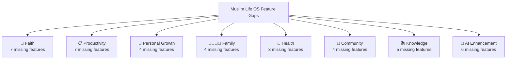
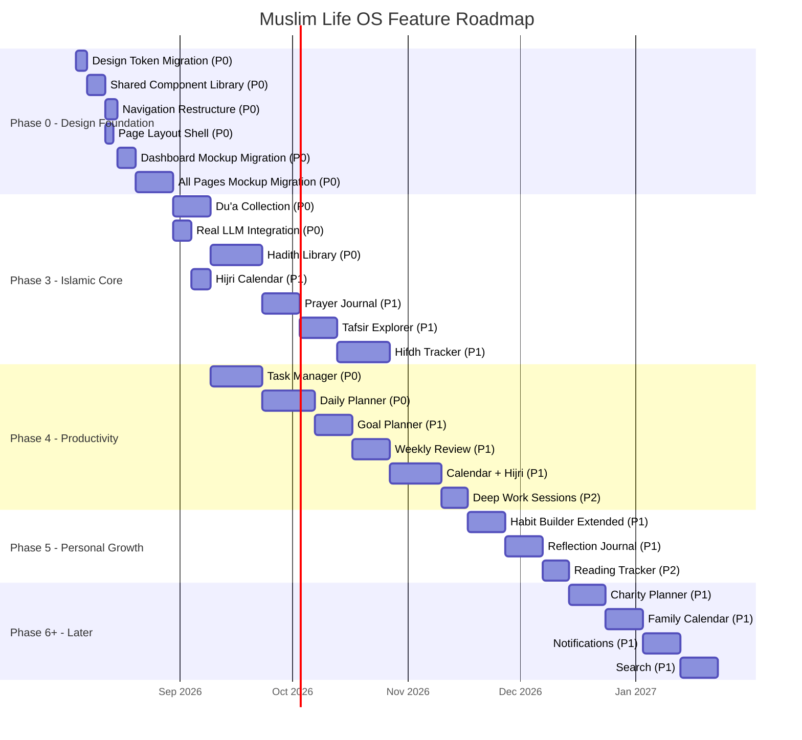

# Muslim Life OS — Phase 3+ Implementation Plan

## Executive Summary

After a thorough audit of the **documentation corpus** (Volumes 00–10), the **current codebase**, and the **Lovable HTML mockups** (`/opt/lifeos/mlos/docs/lovable-mockups/html-mockups/`), this plan identifies **every essential feature** that the docs mandate but the app does not yet have. Features are grouped into prioritised phases with dependency ordering.

> [!IMPORTANT]
> **Mockup Compliance Mandate**: The [Lovable HTML mockups](file:///opt/lifeos/mlos/docs/lovable-mockups/html-mockups) are the **single source of truth** for all frontend implementation. Every page, component, colour, font, spacing value, animation, and interaction pattern MUST match the mockups pixel-for-pixel. The current frontend uses a different design system (oklch teal, Inter font, 8pt grid) that must be **replaced** with the mockup design system. No deviation is permitted without updating the mockup first.

---

## Current State Audit

### ✅ What's Already Built (Phase 1 & 2)

| Domain | Feature | Status |
|--------|---------|--------|
| **Auth** | Register, Login, Password Reset, JWT auth | ✅ Complete |
| **Onboarding** | Multi-step wizard (name, goals, location) | ✅ Complete |
| **Prayer** | Prayer times calculation (9 methods), Asr juristic, prayer logging, prayer status, consistency metrics | ✅ Complete |
| **Qur'an** | Surah list, Ayah reader (Arabic + translation), bookmarks, reading progress, weekly summary | ✅ Complete |
| **Dhikr** | Dhikr items catalogue (morning/evening/general), session logging, daily summary, counter UI | ✅ Complete |
| **AI Assistant** | Conversation CRUD, message threading, AI safety refusal, Postgres-backed storage, memory entries | ✅ Complete |
| **Family** | Family creation, member listing, invite system, member removal, privacy enforcement | ✅ Complete |
| **Fasting** | Daily fasting log, fasting status check | ✅ Complete |
| **Settings** | Location search (Nominatim), prayer method, Asr method, theme switcher (light/dark/system), data export link | ✅ Complete |
| **Navigation** | 5-tab bottom nav (Home, Qur'an, Dhikr, Assistant, Profile) | ✅ Complete |
| **Infrastructure** | PostgreSQL, Alembic migrations, SQLAlchemy repos, Docker Compose | ✅ Complete |

### ❌ What's Missing — Gap Analysis

Comparing the [Feature Catalogue](file:///opt/lifeos/docs/Volume_01_Product_Design/013_Feature_Catalogue.md), [Product Scope](file:///opt/lifeos/docs/Volume_01_Product_Design/012_Product_Scope.md), [Information Architecture](file:///opt/lifeos/docs/Volume_01_Product_Design/017_Information_Architecture.md), and [Product Manifesto](file:///opt/lifeos/docs/Volume_00_Foundation/004_Product_Manifesto.md) against the codebase reveals **8 major feature domains** with significant gaps:



### 🎨 Frontend Design System Gap — Critical

> [!CAUTION]
> The current frontend design system is **incompatible** with the approved Lovable mockups. A full migration is required BEFORE any feature work begins.

| Aspect | Current Codebase | Lovable Mockups | Action |
|--------|-----------------|-----------------|--------|
| **Font (UI)** | `Inter` | `Plus Jakarta Sans` | Replace |
| **Font (Scripture)** | None | `Lora` (serif) | Add |
| **Font (Arabic)** | `Amiri` | `Amiri` | ✅ Keep |
| **Colours** | oklch-based teal (`--primary`) | Hex-based muted emerald (`#1f6b52`) | Replace |
| **Background** | oklch neutral | `#faf7f1` warm parchment | Replace |
| **Dark surfaces** | oklch dark | `#0d1211` green-black | Replace |
| **Accent** | Gold (oklch) | `#a8863f` brass (completion-only) | Replace |
| **Grid** | 8pt spacing | 4pt base grid | Replace |
| **Card radius** | Mixed | 18px consistently | Standardise |
| **Card borders** | Mixed shadows/borders | 1px hairline `--line` only, no shadows | Replace |
| **Skeletons** | `StarSpinner` | Content-shaped `.sk` with 1.6s pulse | Replace |
| **Component lib** | shadcn/ui (Radix) | Custom primitives per mockup | Rebuild |
| **Bottom nav** | 5 tabs (Home, Qur'an, Dhikr, Assistant, Profile) | 5 tabs (Home, Qur'an, Dhikr, Du'as, More) | Remap |
| **Desktop nav** | None | 220px left sidebar | Add |

---

## Lovable Mockup Design System (Canonical Reference)

> [!IMPORTANT]
> This section is the **exact specification** that all frontend code must implement. Values are extracted directly from the [approved mockup CSS](file:///opt/lifeos/mlos/docs/lovable-mockups/html-mockups/dashboard/index.html). Every implementing agent must read this section before writing any frontend code.

### Mockup File Index

| Module | HTML Mockup | Design Rationale | Screens |
|--------|-------------|------------------|---------|
| **Dashboard** | [index.html](file:///opt/lifeos/mlos/docs/lovable-mockups/html-mockups/dashboard/index.html) | [design-rationale.md](file:///opt/lifeos/mlos/docs/lovable-mockups/html-mockups/dashboard/design-rationale.md) | 14 frames: mobile/tablet/desktop × light/dark × populated/loading/empty |
| **AI Assistant** | [index.html](file:///opt/lifeos/mlos/docs/lovable-mockups/html-mockups/ai/index.html) | [ai-assistant-rationale.md](file:///opt/lifeos/mlos/docs/lovable-mockups/html-mockups/ai/ai-assistant-rationale.md) | Conversation list, chat, sources pill, voice sheet |
| **Dhikr** | [index.html](file:///opt/lifeos/mlos/docs/lovable-mockups/html-mockups/dhikr/index.html) | [design-rationale.md](file:///opt/lifeos/mlos/docs/lovable-mockups/html-mockups/dhikr/design-rationale.md) | 18 frames: category browser, session, counter, guided, completion, stats, history |
| **Du'as** | [index.html](file:///opt/lifeos/mlos/docs/lovable-mockups/html-mockups/duas/index.html) | [duas-design-rationale.md](file:///opt/lifeos/mlos/docs/lovable-mockups/html-mockups/duas/duas-design-rationale.md) | Library, card detail, categories, favourites, audio controls |
| **Family** | [index.html](file:///opt/lifeos/mlos/docs/lovable-mockups/html-mockups/family/index.html) | [family-design-rationale.md](file:///opt/lifeos/mlos/docs/lovable-mockups/html-mockups/family/family-design-rationale.md) | Member list, shared activity, privacy blocks |
| **Hadith** | [index.html](file:///opt/lifeos/mlos/docs/lovable-mockups/html-mockups/hadith/index.html) | [design-rationale.md](file:///opt/lifeos/mlos/docs/lovable-mockups/html-mockups/hadith/design-rationale.md) | Collection browser, chapter nav, search, bookmarks |
| **Prayer** | [index.html](file:///opt/lifeos/mlos/docs/lovable-mockups/html-mockups/prayer/index.html) | [prayer-design-rationale.md](file:///opt/lifeos/mlos/docs/lovable-mockups/html-mockups/prayer/prayer-design-rationale.md) | Time strip, logging, Qibla compass, journal |
| **Qur'an** | [index.html](file:///opt/lifeos/mlos/docs/lovable-mockups/html-mockups/quran/index.html) | [design-rationale.md](file:///opt/lifeos/mlos/docs/lovable-mockups/html-mockups/quran/design-rationale.md) | Surah list, reader, bookmarks, hifdh |
| **Settings** | [index.html](file:///opt/lifeos/mlos/docs/lovable-mockups/html-mockups/settings/index.html) | [refinement-notes.md](file:///opt/lifeos/mlos/docs/lovable-mockups/html-mockups/settings/refinement-notes.md) | Preferences, account, UI toggles |

### CSS Custom Properties (Design Tokens)

These **exact values** must replace the current oklch-based tokens in `src/styles.css`:

```css
/* ── Light theme (default) ── */
:root {
  --bg:           #faf7f1;   /* Warm parchment page ground          */
  --surface:      #ffffff;   /* Card fill                            */
  --line:         #e7e1d6;   /* 1px hairline borders, unfilled track */
  --ink:          #1c1f1d;   /* Primary text (green-cast near-black) */
  --mute:         #6f7570;   /* Secondary text, labels               */
  --primary:      #1f6b52;   /* Muted emerald — actions, active nav  */
  --primary-soft: #e6f0ea;   /* Active-state wash, glyph tiles       */
  --brass:        #a8863f;   /* Completion/khushoo ONLY — never generic */
  --skel:         #e7e2d8;   /* Skeleton fill                        */
}

/* ── Dark theme ── */
.dark {
  --bg:           #0d1211;
  --surface:      #141a18;
  --line:         #232b28;
  --ink:          #eef2ef;
  --mute:         #8d9791;
  --primary:      #4fae8b;
  --primary-soft: #16241f;
  --brass:        #d3ad5f;
  --skel:         #1e2724;
}
```

**Brass rule**: `--brass` is reserved per-screen for ONE semantic meaning: khushoo rating (dashboard), completion (dhikr), or authenticity grade (hadith). It is **never** used for generic progress, backgrounds, or decoration.

### Typography

```css
/* Fonts — loaded via Google Fonts */
--font-ui:      'Plus Jakarta Sans', system-ui, sans-serif;
--font-serif:   'Lora', Georgia, serif;
--font-arabic:  'Amiri', serif;
```

| Role | Font | Size | Weight | Extra |
|------|------|------|--------|-------|
| Page title | Plus Jakarta Sans | 26px | 700 | `letter-spacing: -.02em` |
| Subhead | Plus Jakarta Sans | 15px | 600 | — |
| Body | Plus Jakarta Sans | 13–14px | 400 | `line-height: 1.65` |
| Card section label | Plus Jakarta Sans | 12px | 600 | `text-transform: uppercase; letter-spacing: .12em` |
| Micro-label | Plus Jakarta Sans | 11px | 600 | `text-transform: uppercase; letter-spacing: .14–.16em` |
| Scripture translation | Lora | 13–15px | 400 | `line-height: 1.6–1.7` |
| Settings page titles | Lora | — | 500 | Serif for quiet authority |
| Hadith quotes | Lora | 15px | 400 | `line-height: 1.7` |
| Arabic text | Amiri | 20px | 400 | `direction: rtl; line-height: 1.9` |
| Counter (session) | Plus Jakarta Sans | 44px | 700 | `font-variant-numeric: tabular-nums` |
| Countdown timer | Plus Jakarta Sans | 26px | 600 | `font-variant-numeric: tabular-nums` |

**Rule**: All timers, counters, and prayer-time numerals MUST use `font-variant-numeric: tabular-nums` to prevent layout jitter.

### Spacing & Layout

| Property | Mobile (≤767px) | Tablet (768–1023px) | Desktop (≥1024px) |
|----------|----------------|--------------------|--------------------|
| Screen padding | `22px 20px` | `30px 32px` | `34px 40px` |
| Card gap | 14px | 14–16px | 16px |
| Card internal padding | 16px | 16px | 16px |
| Section gap | 22px | 22px | 22px |
| Base grid unit | 4px | 4px | 4px |

### Shape & Elevation

| Element | Radius | Border | Shadow |
|---------|--------|--------|--------|
| Card | 18px | `1px solid var(--line)` | **None** |
| Settings card | 16px | `1px solid var(--line)` | **None** |
| Hero banner | 20px | None | **None** |
| Button | 11px | None | **None** |
| Pill/badge | 99px | None | **None** |
| Circle (prayer/avatar) | 99px | `1.5px dashed var(--line)` | **None** |
| Inline prompt | 12px | None | **None** |
| Avatar tile | 12px | — | **None** |
| Density cell | 4px | — | **None** |
| Settings switch | 40×23px | — | — |

**Elevation rule**: The app surface is **completely flat**. Cards use a 1px hairline border (`var(--line)`), never box-shadow. No drop shadows, no elevation rings, no floating elements.

### Navigation

| Viewport | Pattern | Details |
|----------|---------|---------|
| Mobile | Bottom tabs | 5 items: **Home · Qur'an · Dhikr · Du'as · More**. 10px top padding, 20px bottom (safe area). Active tab uses `var(--primary)` text + `primary-soft` bg on icon. |
| Tablet | Bottom tabs | Same 5 items; content area uses 2-column grid. |
| Desktop | 220px left sidebar | Always visible. Brand + nav links. Active link: `primary-soft` bg, `primary` text, `font-weight: 600`. |

**Tab mapping change**: The current "Assistant" and "Profile" tabs are replaced with "Du'as" and "More" (which leads to a sub-menu for Assistant, Family, Settings, Profile, Hadith, Prayer Journal).

### Shared Component Classes

Every implementing agent must build or adapt these shared primitives to match the mockups:

| Component | Mockup Class | Specification |
|-----------|-------------|---------------|
| **Card** | `.card` | `bg: var(--surface); border: 1px solid var(--line); border-radius: 18px; padding: 16px` |
| **Card heading** | `.card h3` | `12px; uppercase; letter-spacing: .12em; color: var(--mute); font-weight: 600` |
| **Button (primary)** | `.btn` | `bg: var(--primary); color: #fff; border-radius: 11px; padding: 9px 16px; font-size: 13px; font-weight: 600`. Dark mode: `color: #08120f` |
| **Button (ghost)** | `.btn.ghost` | Transparent bg, `var(--primary)` text, same sizing |
| **Pill/badge** | `.pill` | `bg: var(--primary-soft); color: var(--primary); border-radius: 99px; padding: 7px 12px; font-size: 12px; font-weight: 600` |
| **Progress ring** | `.ring` | `conic-gradient(var(--primary) var(--pct), var(--line) 0)` with inner cutout |
| **Progress bar** | `.bar` | `7px height; border-radius: 9px; bg: var(--line)` with inner fill in `var(--primary)` |
| **Week dots** | `.weekdots` | 7 flex items, `26px height; 7px radius; bg: var(--line)`. `.on`: `var(--primary)`. `.part`: `var(--primary)` at `opacity: .42` |
| **Density grid** | `.density` | 12-week grid, same 3-level colouring as weekdots, cell radius 4px |
| **Empty state** | `.empty` | Centred. `.glyph`: 38×38px tinted tile (`primary-soft` bg, `primary` colour, 12px radius). Warm copy in `13px var(--mute)`. Single `.btn` action. |
| **Skeleton** | `.sk` | `bg: var(--skel); border-radius: 8px; animation: pulse 1.6s ease-in-out infinite`. Variants: `.sk-hero` (full banner shape), `.sk-line` (11px text line), `.sk-circ` (44px circle) |
| **Arabic text** | `.ar` | `font-family: var(--font-arabic); direction: rtl; font-size: 20px; line-height: 1.9` |
| **Translation text** | `.tr` | `font-family: var(--font-serif); font-size: 13px; line-height: 1.6; color: var(--mute)` |
| **Quote** | `.quote` | `font-family: var(--font-serif); font-size: 15px; line-height: 1.7` |
| **Attribution** | `.attrib` | `font-size: 12px; color: var(--mute)` |
| **Prayer circle** | `.circ` | `44×44px; border-radius: 99px`. States: dashed outline (unlogged), solid `--primary` bg + white check (done), solid outline + dash (missed). |
| **Khushoo moons** | `.moon` | `26×26px; border-radius: 99px; border: 1px solid var(--line)`. Active: `border-color: var(--brass); color: var(--brass)` |
| **Tabs (bottom)** | `.tabs` | `border-top: 1px solid var(--line); bg: var(--surface); padding: 10px 8px 20px`. Active: `color: var(--primary)` |
| **Sidebar (desktop)** | `.side` | `width: 220px; border-right: 1px solid var(--line); bg: var(--surface); padding: 26px 16px` |
| **Search bar** | `.searchbar` | Top-mounted instant-filter input per mockup |
| **Timeline** | `.tl` | Day-grouped timeline with hairline separators |

### Animation & Motion

| Animation | Spec | `prefers-reduced-motion` |
|-----------|------|--------------------------|
| Skeleton pulse | `opacity 1 → .45 → 1` over `1.6s ease-in-out infinite` | Disabled |
| Breathing halo (dhikr) | `scale 1.00 → 1.04; opacity 0 → 0.5` over `6s` cycle | Static low-contrast disc |
| State transitions | Opacity/translate changes, no bounce/spring | Instant |
| Guided mode crossfade | 800ms hold, 400ms crossfade | Instant |

**Motion rule**: No bounce, no spring, no confetti, no count-up animation. The only two animated elements are the skeleton pulse and the dhikr breathing halo. Everything else is instant opacity/translate.

### Hero Banner Time-of-Day Gradients

| Time Window | Light Gradient | Dark Gradient |
|-------------|---------------|---------------|
| **Fajr (pre-dawn)** | `linear-gradient(160deg, #131a34, #2b2350, #8a5a2b)` | Same (already dark) |
| **Daytime (Dhuhr–Asr)** | `linear-gradient(160deg, #2f7fb8, #2367a6, #1d4f86)` | `linear-gradient(160deg, #0e1330, #141a2e, #0a0d1c)` |
| **Maghrib (sunset)** | `linear-gradient(160deg, #8a4a0e, #a3542e, #6b2d4d)` | `linear-gradient(160deg, #1a0e08, #2a1418, #12091a)` |
| **Isha (night)** | `linear-gradient(160deg, #0e1330, #141a2e, #0a0d1c)` | Same (already dark) |

The hero carries a subtle **khatam star tessellation** at 7% opacity via inline SVG background pattern. Text uses white at 100/75/62% opacity tiers — no per-gradient colour overrides.

---

## Phase 0 — Frontend Design Foundation (PREREQUISITE)

> [!CAUTION]
> This phase MUST be completed before any feature work in Phases 3–10. Every subsequent phase assumes the mockup design system is in place.

**Priority: P0 — Blocker** | **Effort: Large** | **Dependencies: None**

### 0A. Design Token Migration
**What**: Replace all oklch-based CSS custom properties in `src/styles.css` with the exact hex values from the mockup design system above.

**Scope**:
- Rewrite `src/styles.css` `:root` and `.dark` blocks with the 9 mockup tokens
- Replace `--font-sans: 'Inter'` with `--font-ui: 'Plus Jakarta Sans'`
- Add `--font-serif: 'Lora'`
- Keep `--font-arabic: 'Amiri'`
- Update Google Fonts import to load `Plus Jakarta Sans:wght@400;500;600;700`, `Lora:ital,wght@0,400;0,500;1,400`, `Amiri:wght@400;700`
- Remove all oklch colour functions
- Set base `font-family` to `var(--font-ui)`

**Reference**: [Dashboard mockup CSS, lines 14–20](file:///opt/lifeos/mlos/docs/lovable-mockups/html-mockups/dashboard/index.html)

---

### 0B. Shared Component Library
**What**: Build the shared primitives (`.card`, `.btn`, `.pill`, `.ring`, `.bar`, `.weekdots`, `.empty`, `.sk`, `.ar`, `.tr`, `.quote`, `.attrib`, `.circ`, `.moon`, `.tabs`, `.side`) as React components that match the mockup CSS exactly.

**Scope**:
- Create `src/components/ui/card.tsx` — mockup `.card` with `.card h3`
- Create `src/components/ui/button.tsx` — mockup `.btn` and `.btn.ghost` (replace shadcn Button)
- Create `src/components/ui/pill.tsx` — mockup `.pill`
- Create `src/components/ui/progress-ring.tsx` — mockup `.ring` with `--pct` CSS var
- Create `src/components/ui/progress-bar.tsx` — mockup `.bar` with `.meta`
- Create `src/components/ui/week-dots.tsx` — mockup `.weekdots`
- Create `src/components/ui/density-grid.tsx` — mockup `.density` (12-week grid)
- Create `src/components/ui/empty-state.tsx` — mockup `.empty` with `.glyph`
- Create `src/components/ui/skeleton.tsx` — mockup `.sk`, `.sk-hero`, `.sk-line`, `.sk-circ`
- Create `src/components/ui/arabic-text.tsx` — mockup `.ar`
- Create `src/components/ui/translation-text.tsx` — mockup `.tr`
- Create `src/components/ui/quote.tsx` — mockup `.quote` + `.attrib`
- Create `src/components/ui/prayer-circle.tsx` — mockup `.circ` with states
- Create `src/components/ui/khushoo-moons.tsx` — mockup `.moon` with `.on` state
- Create `src/components/ui/search-bar.tsx` — mockup `.searchbar`

**Reference**: [Dashboard mockup CSS, lines 49–131](file:///opt/lifeos/mlos/docs/lovable-mockups/html-mockups/dashboard/index.html)

---

### 0C. Navigation Restructure
**What**: Replace the current 5-tab layout (Home, Qur'an, Dhikr, Assistant, Profile) with the mockup navigation (Home, Qur'an, Dhikr, Du'as, More) and add the desktop sidebar.

**Scope**:
- Rebuild `src/components/layout/bottom-tabs.tsx` to match mockup `.tabs` CSS exactly
- Remap tabs: Du'as replaces Assistant; More replaces Profile
- "More" opens a sub-navigation to: Assistant, Family, Hadith, Prayer Journal, Settings, Profile
- Create `src/components/layout/sidebar.tsx` to match mockup `.side` CSS for ≥1024px viewports
- Add responsive breakpoint logic: bottom tabs ≤1023px, sidebar ≥1024px
- Sidebar nav links use `.nav a` / `.nav a.on` styling from mockup

**Reference**: [Dashboard mockup CSS, lines 115–132](file:///opt/lifeos/mlos/docs/lovable-mockups/html-mockups/dashboard/index.html)

---

### 0D. Page Layout Shell
**What**: Establish the responsive page shell with correct padding, scroll container, and screen composition.

**Scope**:
- Create `src/components/layout/page-shell.tsx`: `.scroll` container with responsive padding (22px/20px mobile, 30px/32px tablet, 34px/40px desktop)
- Create `src/components/layout/app-shell.tsx`: `.app` wrapper with `--bg` background, flex column, correct font
- Greeting block component: Arabic السلام عليكم (12px uppercase `.14em` tracking), name (26px/700), Hijri date in `var(--primary)` + Gregorian in `var(--mute)`
- Responsive grid helpers: `.grid2` (2-column), `.dgrid` (3-column desktop: `1.35fr 1fr 1fr`)

**Reference**: [Dashboard mockup CSS, lines 15–24 and 129–132](file:///opt/lifeos/mlos/docs/lovable-mockups/html-mockups/dashboard/index.html)

---

### 0E. Migrate All Existing Pages
**What**: Re-skin every existing page to use the new mockup design system and components.

**Scope**: For each existing page, compare side-by-side against the corresponding mockup HTML file and rebuild the page layout, components, and styling to match exactly. Pages to migrate:

| Page | Mockup Reference |
|------|------------------|
| Home/Dashboard | [dashboard/index.html](file:///opt/lifeos/mlos/docs/lovable-mockups/html-mockups/dashboard/index.html) — all 14 frames |
| Prayer Times | [prayer/index.html](file:///opt/lifeos/mlos/docs/lovable-mockups/html-mockups/prayer/index.html) |
| Qur'an | [quran/index.html](file:///opt/lifeos/mlos/docs/lovable-mockups/html-mockups/quran/index.html) |
| Dhikr | [dhikr/index.html](file:///opt/lifeos/mlos/docs/lovable-mockups/html-mockups/dhikr/index.html) — all 18 frames |
| Du'as | [duas/index.html](file:///opt/lifeos/mlos/docs/lovable-mockups/html-mockups/duas/index.html) |
| Hadith | [hadith/index.html](file:///opt/lifeos/mlos/docs/lovable-mockups/html-mockups/hadith/index.html) |
| AI Assistant | [ai/index.html](file:///opt/lifeos/mlos/docs/lovable-mockups/html-mockups/ai/index.html) |
| Family | [family/index.html](file:///opt/lifeos/mlos/docs/lovable-mockups/html-mockups/family/index.html) |
| Settings | [settings/index.html](file:///opt/lifeos/mlos/docs/lovable-mockups/html-mockups/settings/index.html) |

**Acceptance Criteria (per page)**:
- [ ] All colours match mockup hex values exactly
- [ ] Typography uses Plus Jakarta Sans / Lora / Amiri per role
- [ ] Card radius is 18px (16px for settings), borders are 1px `var(--line)`, zero shadows
- [ ] Spacing matches mockup (4pt grid, 14–16px card gaps, responsive padding)
- [ ] Loading state uses content-shaped `.sk` skeletons (no spinner)
- [ ] Empty state uses `.empty` pattern with warm copy and single action
- [ ] Dark mode matches mockup dark theme exactly
- [ ] Bottom tabs show Home / Qur'an / Dhikr / Du'as / More
- [ ] Desktop shows 220px sidebar

---

## Phase 0 — Module-Specific Mockup Compliance

### 0F. Dashboard — Strict Mockup Implementation
**Reference**: [dashboard/index.html](file:///opt/lifeos/mlos/docs/lovable-mockups/html-mockups/dashboard/index.html) + [design-rationale.md](file:///opt/lifeos/mlos/docs/lovable-mockups/html-mockups/dashboard/design-rationale.md)

**Frontend requirements from mockup**:
- **Greeting block**: Arabic السلام عليكم above transliterated greeting; Hijri date in emerald (`var(--primary)`), Gregorian muted
- **Hero prayer banner**: Time-of-day gradient (4 themes); khatam star tessellation at 7% opacity SVG pattern; prayer name left, countdown right on same baseline; "remaining" label at reduced opacity; 5 prayer times strip below hairline, current prayer at full opacity with 2px underline; text white at 100/75/62% opacity tiers
- **Today's Prayers card**: 5 × 44px circles (`.circ`), dashed for unlogged, emerald for done, solid outline for missed; labels as 3-letter abbreviations; reflection prompt (`.prompt`) — "How was your Asr? · Reflect →" in `primary-soft` bg; khushoo moon phases (`.moon`) with brass accent
- **2-column grid**: Du'a of the Day (Arabic > translation > citation hierarchy) + Dhikr ring (conic-gradient `.ring`)
- **Qur'an this week**: `.bar` progress + `.weekdots` 7-day strip + sentence-based insight
- **Hadith of the Day**: `.quote` in Lora serif + `.attrib`
- **Consistency card**: Sentence-based insight ("You've prayed Fajr on time 6 of the last 7 days — your steadiest week yet"), `.weekdots` strip, NEVER raw numbers
- **Fasting card**: State as milestone sentence ("6h 12m until Maghrib"), `.pill` for today's log
- **Qibla card**: Text bearing ("118° SE") as primary rendering, compass as secondary
- **Loading**: Content-shaped skeletons only; greeting renders immediately; hero skeleton has faint gradient tint
- **Empty**: No zeroes, no fake charts. Warm copy per card, single action each. Hero always renders (prayer times are computed, never empty)
- **Tablet**: 2-column grid, hero spans full width
- **Desktop**: Sidebar + 3-column `.dgrid` (`1.35fr 1fr 1fr`)

---

### 0G. Dhikr — Strict Mockup Implementation
**Reference**: [dhikr/index.html](file:///opt/lifeos/mlos/docs/lovable-mockups/html-mockups/dhikr/index.html) + [design-rationale.md](file:///opt/lifeos/mlos/docs/lovable-mockups/html-mockups/dhikr/design-rationale.md)

**Frontend requirements from mockup**:
- **Category browser**: Sectioned list by time (Morning, Evening, After Prayer, Before Sleep, General) — NOT a tile grid; one session button per section at section head; card anatomy: Arabic (Amiri RTL) > Lora translation > `n of m` meta or brass "Complete" pill; 44px `.ring` on right of each card
- **Session mode**: Full-bleed takeover on `var(--bg)` — NOT pure black; Arabic + translation in upper 2/3; counter/hint/controls in bottom 1/3 below hairline; counter at 44px tabular numerals; entire area below hairline is tap target ("Tap anywhere below to count"); long-press to undo (no visible minus button)
- **Breathing halo** (`.breath`): `primary-soft` halo behind counter ring; `scale 1.00 → 1.04; opacity 0 → 0.5` over 6s cycle; disabled under `prefers-reduced-motion`
- **Progress dots**: 7 small bars at top showing item position — solid for completed, 55% opacity for current, `var(--line)` for remaining
- **Haptics**: `navigator.vibrate(10)` per count, user-toggleable, off on desktop
- **Guided mode**: Transliteration line, thin top progress bar, Pause/Skip controls, 800ms hold on target + 400ms crossfade to next item
- **Completion summary**: Centred card, brass khatam glyph, relevant ayah in Lora italic, meta rows (counts, time, items). NO score, rank, streak, comparison, or share affordance
- **Statistics**: `.weekdots` + sentence insight; 12-week `.density` grid (3-level: full, half-opacity, empty); "steadiest time" and "average session" compact cards
- **History**: Reverse-chronological, grouped by day; Hijri date primary, Gregorian muted; khatam glyph tile per row; hairline separators inside card (not individual cards); explicit "Load earlier" button (no infinite scroll)
- **Error state**: No red; plain language; "counting still works offline"; cached adhkar listed under "Available offline"
- **Desktop rail**: Today total, week strip, recent sessions

---

### 0H. AI Assistant — Strict Mockup Implementation
**Reference**: [ai/index.html](file:///opt/lifeos/mlos/docs/lovable-mockups/html-mockups/ai/index.html) + [ai-assistant-rationale.md](file:///opt/lifeos/mlos/docs/lovable-mockups/html-mockups/ai/ai-assistant-rationale.md)

**Frontend requirements from mockup**:
- **Conversation list**: `.tl` timeline groups + `.crow` conversation rows
- **Bubble-less chat**: Assistant turns sit on the surface without chat bubbles — like a book page for long-form reading. User turns may use subtle differentiation
- **Sources pill**: Collapsible "n sources" pill expanding into `.srccard` reference cards
- **Voice sheet**: Full-screen modal with `.ring` breathing animation (6s cycle), NOT a reactive waveform
- **Study companion framing**: Not for fiqh/fatwas — UI should reinforce this boundary

---

### 0I. Settings — Strict Mockup Implementation
**Reference**: [settings/index.html](file:///opt/lifeos/mlos/docs/lovable-mockups/html-mockups/settings/index.html) + [refinement-notes.md](file:///opt/lifeos/mlos/docs/lovable-mockups/html-mockups/settings/refinement-notes.md)

**Frontend requirements from mockup**:
- **Refined layout**: Airier spacing, 16px card radii (not 18px)
- **Page title**: `Lora` serif for quiet authority
- **Switches**: 40×23px, calmer colouring
- **Hairlines**: `--hair` variant (72–85% of `--line`) for row dividers
- **Min row height**: 56px for settings rows

---

### 0J. Du'as — Strict Mockup Implementation
**Reference**: [duas/index.html](file:///opt/lifeos/mlos/docs/lovable-mockups/html-mockups/duas/index.html) + [duas-design-rationale.md](file:///opt/lifeos/mlos/docs/lovable-mockups/html-mockups/duas/duas-design-rationale.md)

**Frontend requirements from mockup**:
- **Card hierarchy**: Arabic takes precedence (largest), then translation (Lora), then citation
- **Play controls**: Inline audio controls for pronunciation
- **Categorisation**: Browsable lists with soft primary `.pill` tags
- **Favourites**: Heart/star toggle on cards

---

### 0K. Prayer — Strict Mockup Implementation
**Reference**: [prayer/index.html](file:///opt/lifeos/mlos/docs/lovable-mockups/html-mockups/prayer/index.html) + [prayer-design-rationale.md](file:///opt/lifeos/mlos/docs/lovable-mockups/html-mockups/prayer/prayer-design-rationale.md)

**Frontend requirements from mockup**:
- **Time strip**: Vertical list with current prayer highlighted via 2px underline and full opacity
- **Qibla compass**: Text fallback ("118° SE") as primary, visual compass secondary

---

### 0L. Qur'an — Strict Mockup Implementation
**Reference**: [quran/index.html](file:///opt/lifeos/mlos/docs/lovable-mockups/html-mockups/quran/index.html) + [design-rationale.md](file:///opt/lifeos/mlos/docs/lovable-mockups/html-mockups/quran/design-rationale.md)

**Frontend requirements from mockup**:
- **Reader**: Distraction-free; Arabic blocks with `lang="ar" dir="rtl"`; translations in Lora LTR
- **Surah/book list**: Clean rows with numeric badge indicating verse count
- **Inline search**: `.searchbar` as instant filter

---

### 0M. Hadith — Strict Mockup Implementation
**Reference**: [hadith/index.html](file:///opt/lifeos/mlos/docs/lovable-mockups/html-mockups/hadith/index.html) + [design-rationale.md](file:///opt/lifeos/mlos/docs/lovable-mockups/html-mockups/hadith/design-rationale.md)

**Frontend requirements from mockup**:
- **Collection browser**: Clean list with search
- **Chapter navigation**: Nested drill-down
- **Bookmarks**: Bookmark toggle per hadith
- **Search**: `.searchbar` instant filter

---

### 0N. Family — Strict Mockup Implementation
**Reference**: [family/index.html](file:///opt/lifeos/mlos/docs/lovable-mockups/html-mockups/family/index.html) + [family-design-rationale.md](file:///opt/lifeos/mlos/docs/lovable-mockups/html-mockups/family/family-design-rationale.md)

**Frontend requirements from mockup**:
- **Member rows** (`.mrow`): 36px avatars; rounded 99px for children, 12px for adults
- **Shared activity list**: Timeline events (`.ev`) bounded by `.tl` classes
- **Privacy blocks**: Dashed bordered `.locked` blocks for restricted states

---

## Phase 3 — Core Islamic Features (Highest Priority)

> [!IMPORTANT]
> These are the **most mission-critical** gaps. The app calls itself a "Muslim Life OS" but is missing essential Islamic features that differentiate it from a generic productivity app.

### 3A. Du'a Collection & Manager
**Priority: P0 — Essential** | **Effort: Medium** | **Dependencies: Phase 0 (design foundation)**

**What**: A curated, searchable library of du'as (supplications) from Qur'an and Sunnah with Arabic text, transliteration, translation, and contextual guidance (when to recite).

**Why**: Mentioned in [Feature Catalogue](file:///opt/lifeos/docs/Volume_01_Product_Design/013_Feature_Catalogue.md#L378) as core Faith feature. Du'as are daily essentials for every Muslim — morning, evening, travel, meals, etc.

**Scope**:
- Backend: `domain/dua/` — Du'a data model, categories (morning, evening, travel, food, sleep, protection, etc.), searchable service
- Backend API: `GET /api/v1/duas`, `GET /api/v1/duas/categories`, `GET /api/v1/duas/{id}`, `POST /api/v1/duas/favourites`
- **Frontend** — MUST match [duas/index.html](file:///opt/lifeos/mlos/docs/lovable-mockups/html-mockups/duas/index.html):
  - Card hierarchy: Arabic (`.ar`, Amiri 20px RTL, largest) → translation (`.tr`, Lora 13px) → citation (`.attrib`, 12px muted)
  - Category browsing with `.pill` tags in `primary-soft`
  - Favourite toggle on cards
  - Inline audio play controls per mockup
  - `.searchbar` instant filter at top
  - Loading: `.sk` content-shaped skeletons
  - Empty: `.empty` with warm copy and single action
- Data: Seed ~100 authentic du'as with sources (Qur'an verse or hadith reference)
- Offline: All du'a data cached locally per [031_Offline_First_Experience.md](file:///opt/lifeos/docs/Volume_01_Product_Design/031_Offline_First_Experience.md)

---

### 3B. Hadith Library
**Priority: P0 — Essential** | **Effort: Large** | **Dependencies: Phase 0**

**What**: Browsable collection of hadith from major authentic collections (Sahih Bukhari, Sahih Muslim, etc.) with search, bookmarks, and chapter navigation.

**Why**: Listed in [Feature Catalogue](file:///opt/lifeos/docs/Volume_01_Product_Design/013_Feature_Catalogue.md#L376) as core Faith feature. The [Islamic Knowledge Framework](file:///opt/lifeos/docs/Volume_00_Foundation/008_Islamic_Knowledge_Framework.md) mandates authentic Sunnah as Level 2 in the knowledge hierarchy.

**Scope**:
- Backend: `domain/hadith/` — Hadith model (narrator chain, Arabic, translation, grade, book, chapter), search service
- Backend API: `GET /api/v1/hadith/collections`, `GET /api/v1/hadith/search`, `GET /api/v1/hadith/{id}`, `POST /api/v1/hadith/bookmarks`
- **Frontend** — MUST match [hadith/index.html](file:///opt/lifeos/mlos/docs/lovable-mockups/html-mockups/hadith/index.html):
  - Collection browser: clean rows with numeric badge, `.searchbar` instant filter
  - Chapter navigation: nested drill-down
  - Hadith card: Arabic (`.ar`) + English translation (`.quote` in Lora) + narrator chain + grade badge
  - Bookmark toggle per hadith
  - Search with `.searchbar` at top
  - Loading: `.sk` skeletons
  - Empty: `.empty` with warm copy
- Data: Integrate an open hadith dataset (e.g., sunnah.com API or local dataset)
- Must display: source collection, book, chapter, hadith number, grade per [008_Islamic_Knowledge_Framework.md](file:///opt/lifeos/docs/Volume_00_Foundation/008_Islamic_Knowledge_Framework.md#L133-L157)

---

### 3C. Prayer Journal & Insights
**Priority: P1 — High** | **Effort: Medium** | **Dependencies: Prayer logging (✅ exists), Phase 0**

**What**: Post-prayer reflection journal (how was your khushoo? what distracted you?) and AI-generated insights over time.

**Why**: Listed as "Prayer Journal" and "Prayer Insights" in the [Feature Catalogue](file:///opt/lifeos/docs/Volume_01_Product_Design/013_Feature_Catalogue.md#L371-L372). Aligns with Constitution [Article 6 (Intention Before Action)](file:///opt/lifeos/docs/Volume_00_Foundation/001_Product_Constitution.md#L112-L118) and the emphasis on reflection.

**Scope**:
- Backend: Extend prayer domain with journal entries (prayer_name, date, khushoo_rating 1-5, notes, distractions)
- Backend API: `POST /api/v1/habits/prayers/journal`, `GET /api/v1/habits/prayers/journal`, `GET /api/v1/habits/prayers/insights`
- **Frontend** — MUST match [prayer/index.html](file:///opt/lifeos/mlos/docs/lovable-mockups/html-mockups/prayer/index.html) prayer journal section:
  - Khushoo rating: 5 `.moon` phase icons (🌑🌘🌗🌖🌕) with brass accent, plain-language caption ("Struggled" → "Present" → "Deep Focus")
  - Reflection prompt: `.prompt` component in `primary-soft` bg, appears inline after prayer time passes
  - Journal history: reverse-chronological list with date, prayer, rating; Hijri primary, Gregorian muted
  - Weekly insights: sentence-based ("Khushoo has trended upward for three weeks. Your calmest prayer is Fajr.") with `.bar` progress and `.meta`
  - Loading/empty states per mockup pattern
- AI Integration: AI can analyze patterns and provide gentle, encouraging insights (per [Article 8](file:///opt/lifeos/docs/Volume_00_Foundation/001_Product_Constitution.md#L140-L166))

---

### 3D. Qur'an Memorisation Assistant (Hifdh Tracker)
**Priority: P1 — High** | **Effort: Large** | **Dependencies: Qur'an module (✅ exists), Phase 0**

**What**: Structured memorisation (hifdh) tracking with spaced repetition, daily revision targets, and progress tracking per surah/juz.

**Why**: "Memorisation Assistant" in [Feature Catalogue](file:///opt/lifeos/docs/Volume_01_Product_Design/013_Feature_Catalogue.md#L374). This is one of the most requested features for Muslim apps. The [Behavioural Science Framework](file:///opt/lifeos/docs/Volume_00_Foundation/009_Behavioural_Science_Framework.md) supports spaced repetition.

**Scope**:
- Backend: `domain/quran/memorisation.py` — track memorised verses, revision schedule (spaced repetition algorithm), daily targets
- Backend API: `POST /api/v1/quran/memorisation/mark`, `GET /api/v1/quran/memorisation/progress`, `GET /api/v1/quran/memorisation/today-review`
- **Frontend** — MUST match [quran/index.html](file:///opt/lifeos/mlos/docs/lovable-mockups/html-mockups/quran/index.html) hifdh section:
  - Progress grid using `.density` pattern with sentence-based insight
  - Daily review queue as a sectioned list
  - "Mark as memorised" flow using `.btn` primary
  - All typography per mockup spec (Arabic in Amiri 20px, translations in Lora)

---

### 3E. Tafsir Explorer
**Priority: P1 — High** | **Effort: Medium** | **Dependencies: Qur'an module (✅ exists), Phase 0**

**What**: Contextual Qur'an commentary (tafsir) linked to ayahs, allowing users to understand verses deeply.

**Why**: "Tafsir Explorer" in [Feature Catalogue](file:///opt/lifeos/docs/Volume_01_Product_Design/013_Feature_Catalogue.md#L375). The [Islamic Knowledge Framework](file:///opt/lifeos/docs/Volume_00_Foundation/008_Islamic_Knowledge_Framework.md) requires distinguishing source from explanation.

**Scope**:
- Backend: Tafsir data model (linked to surah/ayah), multiple tafsir sources (Ibn Kathir, etc.)
- Backend API: `GET /api/v1/quran/surahs/{id}/ayahs/{id}/tafsir`
- **Frontend** — MUST match [quran/index.html](file:///opt/lifeos/mlos/docs/lovable-mockups/html-mockups/quran/index.html) tafsir section:
  - Tafsir panel in ayah reader (swipe/tap to reveal) using `.card` container
  - Source selector using `.pill` tags
  - Reading mode with `.quote` (Lora serif) for commentary text
  - Arabic text in `.ar` class
- Data: Integrate an open tafsir dataset

---

### 3F. Islamic Learning Paths
**Priority: P2 — Medium** | **Effort: Large** | **Dependencies: Knowledge domain, Phase 0**

**What**: Structured learning curricula covering essential Islamic topics (Aqidah, Fiqh basics, Seerah, Qur'anic Arabic) with progress tracking.

**Why**: "Islamic Learning Paths" in [Feature Catalogue](file:///opt/lifeos/docs/Volume_01_Product_Design/013_Feature_Catalogue.md#L379). The [Product Manifesto](file:///opt/lifeos/docs/Volume_00_Foundation/004_Product_Manifesto.md#L217-L230) emphasises connected, practical knowledge.

**Scope**:
- Backend: `domain/learning/` — Learning path model (modules, lessons, quizzes), enrollment, progress tracking
- Backend API: CRUD for learning paths, enrollment, lesson completion, quiz results
- **Frontend**: Use mockup card pattern (`.card` with `.bar` progress + sentence insight), sectioned list for modules. New mockup to be created for this page (extend from existing design system — no new tokens permitted).

---

## Phase 4 — Productivity Domain (High Priority)

> [!NOTE]
> The [Product Scope](file:///opt/lifeos/docs/Volume_01_Product_Design/012_Product_Scope.md#L143-L153) defines Muslim Life OS as a "productivity platform." Currently **zero** productivity features exist beyond prayer/habit tracking.

### 4A. Daily Planner
**Priority: P0 — Essential** | **Effort: Large** | **Dependencies: Prayer times (✅ exists), Phase 0**

**What**: A day view planner that integrates prayer times as anchor points, allowing users to plan their day around salah. Time-blocking, task assignment to time slots.

**Why**: "Daily Planner" in [Feature Catalogue](file:///opt/lifeos/docs/Volume_01_Product_Design/013_Feature_Catalogue.md#L382). The concept of planning around prayer is uniquely Islamic and central to the app's differentiation.

**Scope**:
- Backend: `domain/planner/` — Day plan model, time blocks, prayer-anchored scheduling
- Backend API: CRUD for daily plans, time blocks
- **Frontend**: No mockup exists yet — MUST be built using the mockup design system tokens and components exclusively:
  - Timeline view with prayer times as fixed anchors, using `.card` containers
  - Time blocks as styled rows inside cards with `.bar` progress
  - Day summary using sentence-based insight pattern
  - All typography, colours, spacing per mockup design system
  - Loading state: content-shaped `.sk` skeletons
  - Empty state: `.empty` pattern with warm copy
- AI Integration: AI can suggest optimal time blocks based on user patterns

---

### 4B. Task Manager
**Priority: P0 — Essential** | **Effort: Large** | **Dependencies: Phase 0**

**What**: Simple but powerful task management with projects, priorities, due dates, recurring tasks, and Islamic priority alignment (worship → family → community → work).

**Why**: "Task Manager" in [Feature Catalogue](file:///opt/lifeos/docs/Volume_01_Product_Design/013_Feature_Catalogue.md#L385). Core productivity feature. Without it, the app cannot function as a "life operating system."

**Scope**:
- Backend: `domain/task/` — Task model (title, description, priority, due_date, project, recurrence, completed, niyyah/intention field)
- Backend API: Full CRUD, filters (today, upcoming, overdue, by project), bulk operations
- **Frontend**: No mockup exists yet — MUST use mockup design system:
  - Task list using `.card` containers with checkbox circles (44px `.circ` pattern)
  - Quick-add input matching `.searchbar` styling
  - Project views as sectioned lists
  - Filters using `.pill` tags in `primary-soft`
  - Optional "intention" field using `.tr` (Lora serif) for visual distinction
  - All colours, typography, spacing per design system
- Unique: Optional "intention" field on tasks — why are you doing this? (per [Article 6](file:///opt/lifeos/docs/Volume_00_Foundation/001_Product_Constitution.md#L112-L118))

---

### 4C. Goal Planner
**Priority: P1 — High** | **Effort: Medium** | **Dependencies: Task Manager, Phase 0**

**What**: Long-term goal setting with milestones, linked tasks, and progress tracking. Support for spiritual goals, family goals, career goals, health goals.

**Why**: "Goal Planner" in [Feature Catalogue](file:///opt/lifeos/docs/Volume_01_Product_Design/013_Feature_Catalogue.md#L389). The [Product Manifesto](file:///opt/lifeos/docs/Volume_00_Foundation/004_Product_Manifesto.md#L96-L112) defines productivity as "doing what matters most."

**Scope**:
- Backend: `domain/goal/` — Goal model (title, category, target_date, milestones, linked_tasks, progress)
- Backend API: CRUD for goals, milestones, progress updates
- **Frontend**: `.card` with `.bar` progress + sentence insight + `.weekdots` for milestone timeline

---

### 4D. Calendar Integration
**Priority: P1 — High** | **Effort: Medium** | **Dependencies: Daily Planner, Prayer times, Phase 0**

**What**: Personal calendar with Islamic date (Hijri) display alongside Gregorian, prayer times overlay, and optional iCal sync.

**Why**: "Calendar" in [Feature Catalogue](file:///opt/lifeos/docs/Volume_01_Product_Design/013_Feature_Catalogue.md#L384). The [Product Scope](file:///opt/lifeos/docs/Volume_01_Product_Design/012_Product_Scope.md#L148) lists Calendar as a core productivity feature.

**Scope**:
- Backend: Event model, Hijri date conversion, recurring events
- Backend API: CRUD events, calendar view endpoints (day/week/month)
- **Frontend**: Hijri date always in `var(--primary)` (emerald) and primary position; Gregorian in `var(--mute)` — matching the dashboard greeting hierarchy

---

### 4E. Weekly Review
**Priority: P1 — High** | **Effort: Medium** | **Dependencies: Prayer logging, Task Manager, Habit Builder, Phase 0**

**What**: Guided weekly review workflow to reflect on worship quality, task completion, habit consistency, and set intentions for the coming week.

**Why**: "Weekly Review" and "Monthly Review" in [Feature Catalogue](file:///opt/lifeos/docs/Volume_01_Product_Design/013_Feature_Catalogue.md#L387-L388). Aligns deeply with the reflection philosophy.

**Scope**:
- Backend: Review entry model, auto-generated weekly stats
- Backend API: `POST /api/v1/reviews/weekly`, `GET /api/v1/reviews/weekly/current`
- **Frontend**: Step-by-step review wizard using `.card` containers, sentence-based insights, `.bar` and `.weekdots` for recaps

---

### 4F. Deep Work Sessions
**Priority: P2 — Medium** | **Effort: Small** | **Dependencies: Phase 0**

**What**: Focus timer with Pomodoro-style sessions, distraction-free mode, and session logging.

**Why**: "Deep Work Sessions" in [Feature Catalogue](file:///opt/lifeos/docs/Volume_01_Product_Design/013_Feature_Catalogue.md#L386). The [Product Constitution Article 10](file:///opt/lifeos/docs/Volume_00_Foundation/001_Product_Constitution.md#L186-L195) mandates respect for time.

**Scope**:
- Backend: Session log model (duration, task, focus_quality)
- Backend API: `POST /api/v1/productivity/focus-sessions`
- **Frontend**: Reuse dhikr session mode pattern — full-bleed `var(--bg)`, large tabular-nums counter, `.breath` halo. NO pure black screen.

---

### 4G. Time Blocking
**Priority: P2 — Medium** | **Effort: Medium** | **Dependencies: Daily Planner, Calendar, Phase 0**

**What**: Visual time-blocking interface integrated with the daily planner.

**Why**: Listed under [Productivity domain](file:///opt/lifeos/docs/Volume_01_Product_Design/012_Product_Scope.md#L151).

---

## Phase 5 — Personal Growth Domain

### 5A. Habit Builder (Extended)
**Priority: P1 — High** | **Effort: Medium** | **Dependencies: Fasting tracker (✅ exists), Phase 0**

**What**: General-purpose habit tracker beyond prayer and fasting. Create custom habits (reading Qur'an daily, exercise, morning adhkar, etc.) with streaks, frequency options, and visual progress.

**Why**: "Habit Builder" in [Feature Catalogue](file:///opt/lifeos/docs/Volume_01_Product_Design/013_Feature_Catalogue.md#L393). Currently only prayer and fasting are trackable. The [Behavioural Science Framework](file:///opt/lifeos/docs/Volume_00_Foundation/009_Behavioural_Science_Framework.md) outlines identity-based habit formation.

**Scope**:
- Backend: `domain/habit/` — Generic habit model (name, frequency, icon, category, streak, completions)
- Backend API: CRUD habits, log completions, get streaks, consistency metrics
- **Frontend**: `.card` daily checklist with 44px `.circ` completion circles, `.weekdots` strip, `.density` grid (12-week), sentence-based insight. **Never** show streak flames, badges, leaderboards, or competitive UI.
- Constitutional constraint: Per [Article 5](file:///opt/lifeos/docs/Volume_00_Foundation/001_Product_Constitution.md#L94-L109), worship habits show encouragement, never leaderboards

---

### 5B. Reflection Journal
**Priority: P1 — High** | **Effort: Medium** | **Dependencies: Phase 0**

**What**: Private journaling with Islamic reflection prompts. Daily or weekly reflections on gratitude, self-improvement, and spiritual growth.

**Why**: "Reflection Journal" in [Feature Catalogue](file:///opt/lifeos/docs/Volume_01_Product_Design/013_Feature_Catalogue.md#L394). Reflection is a core theme across the [Product Constitution](file:///opt/lifeos/docs/Volume_00_Foundation/001_Product_Constitution.md), [Manifesto](file:///opt/lifeos/docs/Volume_00_Foundation/004_Product_Manifesto.md), and [Philosophy](file:///opt/lifeos/docs/Volume_01_Product_Design/010_Product_Philosophy.md).

**Scope**:
- Backend: `domain/journal/` — Journal entry model (date, type, mood, content, prompts_used, private)
- Backend API: CRUD journal entries, prompt library
- **Frontend**: Journal editor in `.card` container, prompts in `.prompt` component (`primary-soft` bg), entry history using `.tl` timeline pattern (Hijri date primary, Gregorian muted)
- Privacy: Journal entries are **absolutely private** — never shared with family per [Article 9](file:///opt/lifeos/docs/Volume_00_Foundation/001_Product_Constitution.md#L169-L183)

---

### 5C. Reading Tracker
**Priority: P2 — Medium** | **Effort: Small** | **Dependencies: Phase 0**

**What**: Track books being read (Islamic and general), reading goals, notes, and book library.

**Why**: "Reading Tracker" in [Feature Catalogue](file:///opt/lifeos/docs/Volume_01_Product_Design/013_Feature_Catalogue.md#L395).

**Scope**:
- Backend: Book model (title, author, category, pages, current_page, status, notes)
- Backend API: CRUD books, reading log, reading goals
- **Frontend**: Book list using `.card` containers, `.bar` progress per book, sentence-based reading insight

---

### 5D. Skill Roadmaps
**Priority: P3 — Low** | **Effort: Large** | **Dependencies: Learning Paths, Phase 0**

**What**: Personalised skill development roadmaps with milestone tracking.

**Why**: "Skill Roadmaps" in [Feature Catalogue](file:///opt/lifeos/docs/Volume_01_Product_Design/013_Feature_Catalogue.md#L396).

---

## Phase 6 — Family Experience (Deepening)

> [!IMPORTANT]
> Per [Article 13](file:///opt/lifeos/docs/Volume_00_Foundation/001_Product_Constitution.md#L223-L235), family features should strengthen family life. The [Family Experience doc](file:///opt/lifeos/docs/Volume_01_Product_Design/026_Family_Experience.md) and [Children Experience doc](file:///opt/lifeos/docs/Volume_01_Product_Design/027_Children_Experience.md) define extensive requirements.

### 6A. Shared Family Calendar
**Priority: P1 — High** | **Effort: Medium** | **Dependencies: Calendar (Phase 4D), Family module (✅ exists), Phase 0**

**What**: Shared calendar for family events, meal planning, school schedules, with privacy-preserving design.

**Why**: "Shared Calendar" in [Feature Catalogue](file:///opt/lifeos/docs/Volume_01_Product_Design/013_Feature_Catalogue.md#L400).

**Frontend**: MUST use [family/index.html](file:///opt/lifeos/mlos/docs/lovable-mockups/html-mockups/family/index.html) patterns — `.mrow` member rows, `.tl` timeline events, `.locked` privacy blocks with dashed borders.

---

### 6B. Family Goals
**Priority: P2 — Medium** | **Effort: Medium** | **Dependencies: Goal Planner, Family module, Phase 0**

**What**: Shared goals the family works toward together (e.g., charity target, Qur'an reading, family outing planning).

**Why**: "Family Goals" in [Feature Catalogue](file:///opt/lifeos/docs/Volume_01_Product_Design/013_Feature_Catalogue.md#L401).

---

### 6C. Parent Dashboard
**Priority: P2 — Medium** | **Effort: Large** | **Dependencies: Family module, Habit Builder, Phase 0**

**What**: Dashboard for parents to gently guide children's learning and habit development. Age-appropriate views for dependents.

**Why**: "Parent Dashboard" in [Feature Catalogue](file:///opt/lifeos/docs/Volume_01_Product_Design/013_Feature_Catalogue.md#L402). The [Children Experience](file:///opt/lifeos/docs/Volume_01_Product_Design/027_Children_Experience.md) doc mandates designed-for-children UX.

**Frontend**: Children avatars use 99px radius (fully rounded); adults use 12px per [family/index.html](file:///opt/lifeos/mlos/docs/lovable-mockups/html-mockups/family/index.html) mockup.

---

### 6D. Household Tasks
**Priority: P2 — Medium** | **Effort: Small** | **Dependencies: Task Manager, Family module, Phase 0**

**What**: Shared household task management with assignment and rotation.

**Why**: "Household Tasks" in [Feature Catalogue](file:///opt/lifeos/docs/Volume_01_Product_Design/013_Feature_Catalogue.md#L403).

---

## Phase 7 — Health Domain

### 7A. Sleep Tracker / Planner
**Priority: P2 — Medium** | **Effort: Medium** | **Dependencies: Phase 0**

**What**: Track sleep/wake times, calculate sleep quality, integrate with prayer times (Fajr alarm). Suggest optimal sleep/wake times based on Fajr.

**Why**: "Sleep Planner" in [Feature Catalogue](file:///opt/lifeos/docs/Volume_01_Product_Design/013_Feature_Catalogue.md#L414). The body is an amanah per the [Manifesto](file:///opt/lifeos/docs/Volume_00_Foundation/004_Product_Manifesto.md#L276-L296).

---

### 7B. Exercise Tracker
**Priority: P2 — Medium** | **Effort: Small** | **Dependencies: Habit Builder, Phase 0**

**What**: Simple exercise logging with types, duration, and weekly goals.

**Why**: "Exercise Planner" in [Feature Catalogue](file:///opt/lifeos/docs/Volume_01_Product_Design/013_Feature_Catalogue.md#L415).

---

### 7C. Energy Tracking & Wellbeing
**Priority: P3 — Low** | **Effort: Small** | **Dependencies: Phase 0**

**What**: Daily energy/mood self-assessment for long-term wellbeing patterns.

**Why**: "Energy Tracking" and "Wellbeing" in [Feature Catalogue](file:///opt/lifeos/docs/Volume_01_Product_Design/013_Feature_Catalogue.md#L416).

---

## Phase 8 — Community Domain

### 8A. Charity Planner (Sadaqah / Zakat)
**Priority: P1 — High** | **Effort: Medium** | **Dependencies: Phase 0**

**What**: Track charitable giving (sadaqah, zakat, fidyah), zakat calculator, giving goals, and donation history.

**Why**: "Charity Planner" in [Feature Catalogue](file:///opt/lifeos/docs/Volume_01_Product_Design/013_Feature_Catalogue.md#L409). Financial ethics is [Article 16](file:///opt/lifeos/docs/Volume_00_Foundation/001_Product_Constitution.md#L270-L286). Charity is fundamental to Islam.

**Scope**:
- Backend: Donation model (type, amount, date, recipient, category), zakat calculation service
- Backend API: CRUD donations, zakat calculator, giving summary
- **Frontend**: `.card` containers, `.bar` progress toward giving goals, sentence-based insight, `.weekdots`/`.density` for giving history

---

### 8B. Masjid Directory
**Priority: P2 — Medium** | **Effort: Medium** | **Dependencies: Location services (✅ exists), Phase 0**

**What**: Find nearby mosques with prayer times, directions, and community info.

**Why**: "Masjid Directory" in [Feature Catalogue](file:///opt/lifeos/docs/Volume_01_Product_Design/013_Feature_Catalogue.md#L407). [Article 14](file:///opt/lifeos/docs/Volume_00_Foundation/001_Product_Constitution.md#L238-L252) mandates encouraging masjid involvement.

---

### 8C. Volunteer Opportunities
**Priority: P3 — Low** | **Effort: Medium** | **Dependencies: Community domain, Phase 0**

**Why**: Listed in [Feature Catalogue](file:///opt/lifeos/docs/Volume_01_Product_Design/013_Feature_Catalogue.md#L408).

---

### 8D. Local Events
**Priority: P3 — Low** | **Effort: Medium** | **Dependencies: Calendar, Community domain, Phase 0**

**Why**: "Local Events" in [Feature Catalogue](file:///opt/lifeos/docs/Volume_01_Product_Design/013_Feature_Catalogue.md#L410).

---

## Phase 9 — Knowledge Domain

### 9A. Notes System
**Priority: P1 — High** | **Effort: Large** | **Dependencies: Phase 0**

**What**: Rich-text note-taking linked to Qur'an verses, hadith, books, and learning paths. Knowledge building tool.

**Why**: "Notes" in [Feature Catalogue](file:///opt/lifeos/docs/Volume_01_Product_Design/013_Feature_Catalogue.md#L223). The [Knowledge Graph Architecture](file:///opt/lifeos/docs/Volume_02_AI_Architecture/043_Knowledge_Graph_Architecture.md) envisions interconnected knowledge.

---

### 9B. Book Library
**Priority: P2 — Medium** | **Effort: Medium** | **Dependencies: Reading Tracker, Phase 0**

**Why**: "Book Library" in [Feature Catalogue](file:///opt/lifeos/docs/Volume_01_Product_Design/013_Feature_Catalogue.md#L223).

---

### 9C. Flashcards
**Priority: P2 — Medium** | **Effort: Medium** | **Dependencies: Phase 0**

**What**: Spaced-repetition flashcard system for memorising Islamic knowledge, Arabic vocabulary, Qur'an verses.

**Why**: "Flashcards" in [Feature Catalogue](file:///opt/lifeos/docs/Volume_01_Product_Design/013_Feature_Catalogue.md#L226).

---

### 9D. Courses
**Priority: P3 — Low** | **Effort: Large** | **Dependencies: Learning Paths, Phase 0**

**Why**: "Courses" in [Feature Catalogue](file:///opt/lifeos/docs/Volume_01_Product_Design/013_Feature_Catalogue.md#L225).

---

### 9E. Knowledge Graph
**Priority: P3 — Low** | **Effort: Very Large** | **Dependencies: Notes, multiple content domains, Phase 0**

**Why**: "Knowledge Graph" in [Feature Catalogue](file:///opt/lifeos/docs/Volume_01_Product_Design/013_Feature_Catalogue.md#L224). Detailed in [043_Knowledge_Graph_Architecture.md](file:///opt/lifeos/docs/Volume_02_AI_Architecture/043_Knowledge_Graph_Architecture.md).

---

## Phase 10 — AI Enhancement

### 10A. Daily AI Coach
**Priority: P1 — High** | **Effort: Medium** | **Dependencies: AI Assistant (✅ exists), all tracking data, Phase 0**

**What**: Proactive daily coaching that synthesizes prayer consistency, habit data, goals, and journal entries to provide personalised, gentle Islamic guidance.

**Why**: "Daily Coach" in [Feature Catalogue](file:///opt/lifeos/docs/Volume_01_Product_Design/013_Feature_Catalogue.md#L420). Must respect [Article 8 (AI Boundaries)](file:///opt/lifeos/docs/Volume_00_Foundation/001_Product_Constitution.md#L140-L166).

**Frontend**: MUST use [ai/index.html](file:///opt/lifeos/mlos/docs/lovable-mockups/html-mockups/ai/index.html) bubble-less chat pattern with sources pill.

---

### 10B. AI Planning Assistant
**Priority: P1 — High** | **Effort: Medium** | **Dependencies: Daily Planner, Task Manager, Phase 0**

**What**: AI that helps plan your day/week, suggests priorities based on Islamic values, and helps with time management.

**Why**: "Planning Assistant" in [Feature Catalogue](file:///opt/lifeos/docs/Volume_01_Product_Design/013_Feature_Catalogue.md#L421).

---

### 10C. AI Reflection Assistant
**Priority: P2 — Medium** | **Effort: Medium** | **Dependencies: Journal, Prayer Journal, Phase 0**

**What**: AI that generates thoughtful Islamic reflection prompts and helps users process their journal entries.

**Why**: "Reflection Assistant" in [Feature Catalogue](file:///opt/lifeos/docs/Volume_01_Product_Design/013_Feature_Catalogue.md#L422).

---

### 10D. AI Learning Coach
**Priority: P2 — Medium** | **Effort: Medium** | **Dependencies: Learning Paths, Qur'an, Phase 0**

**What**: AI that adapts learning content, quizzes, and recommendations based on user's knowledge level.

**Why**: "Learning Coach" in [Feature Catalogue](file:///opt/lifeos/docs/Volume_01_Product_Design/013_Feature_Catalogue.md#L424).

---

### 10E. Real LLM Provider Integration
**Priority: P0 — Essential** | **Effort: Small** | **Dependencies: AI module (✅ exists)**

**What**: Connect the AI backend to a real LLM (OpenAI, Anthropic, or open-source). Currently using in-memory stub. check i am using open router. you can add gemini API key also

**Why**: The AI assistant is useless without a real provider. All AI features depend on this.

**Scope**:
- Configure `MLOS_AI_PROVIDER=openai` with API key (i will use gemini )
- Implement Islamic safety system prompt per [AI Safety Framework](file:///opt/lifeos/docs/Volume_02_AI_Architecture/048_AI_Safety_Framework.md)
- Add confidence indicators to responses per [Islamic Knowledge Framework](file:///opt/lifeos/docs/Volume_00_Foundation/008_Islamic_Knowledge_Framework.md#L215-L236)

---

### 10F. AI Memory & Personalisation
**Priority: P1 — High** | **Effort: Medium** | **Dependencies: Real LLM, Memory module (✅ exists), Phase 0**

**What**: AI that remembers user context, preferences, goals, and previous conversations to provide personalised coaching.

**Why**: [AI Memory Architecture](file:///opt/lifeos/docs/Volume_02_AI_Architecture/041_AI_Memory_Architecture.md) and [Personalisation Framework](file:///opt/lifeos/docs/Volume_01_Product_Design/029_Personalisation_Framework.md).

---

## Cross-Cutting Features (Needed Across All Phases)

### CC1. Notification System
**Priority: P1 — High** | **Effort: Medium**

**What**: Push notifications for prayer times, habit reminders, review prompts, family events. Per the [Notification Framework](file:///opt/lifeos/docs/Volume_01_Product_Design/023_Notification_Framework.md), notifications must be respectful, optional, and never used for engagement manipulation.

---

### CC2. Search
**Priority: P1 — High** | **Effort: Medium**

**What**: Global search across all content — Qur'an, hadith, du'as, tasks, notes, goals. MUST use the `.searchbar` component from mockups (top-mounted instant filter).

---

### CC3. Hijri Calendar Support
**Priority: P1 — High** | **Effort: Small**

**What**: Islamic (Hijri) date display throughout the app. Per the mockups, Hijri is ALWAYS displayed in `var(--primary)` (emerald) with `font-weight: 600`, positioned BEFORE the Gregorian date which is in `var(--mute)`. This hierarchy establishes which calendar the app is organised around.

---

### CC4. Internationalisation (i18n)
**Priority: P2 — Medium** | **Effort: Large**

**What**: Multi-language support starting with Arabic, Urdu, Turkish, Malay, French. Per [035_Internationalisation_and_Localisation.md](file:///opt/lifeos/docs/Volume_01_Product_Design/035_Internationalisation_and_Localisation.md).

**Frontend**: Arabic runs are `lang="ar" dir="rtl"` per element; the shell stays LTR unless the user selects an RTL language globally.

---

### CC5. Offline-First Architecture
**Priority: P2 — Medium** | **Effort: Large**

**What**: Core features (prayer times, du'as, Qur'an, dhikr, tasks) must work offline. Per [031_Offline_First_Experience.md](file:///opt/lifeos/docs/Volume_01_Product_Design/031_Offline_First_Experience.md).

**Frontend error pattern**: Per [dhikr/design-rationale.md](file:///opt/lifeos/mlos/docs/lovable-mockups/html-mockups/dhikr/design-rationale.md) — NO red error states. Glyph tile drops `primary-soft` fill, plain-language explanation, confirm offline functionality still works, show cached data under "Available offline."

---

### CC6. Data Export & Portability
**Priority: P2 — Medium** | **Effort: Small**

**What**: Full data export (JSON/CSV) for user ownership. Per [Article 9](file:///opt/lifeos/docs/Volume_00_Foundation/001_Product_Constitution.md#L169-L183) and [030_Settings_and_Privacy_UX.md](file:///opt/lifeos/docs/Volume_01_Product_Design/030_Settings_and_Privacy_UX.md).

---

## Recommended Implementation Order



---

## Priority Summary Table

| Priority | Feature | Domain | Effort | Mockup |
|----------|---------|--------|--------|--------|
| **P0** | **Design Token Migration** | **Foundation** | **Medium** | **All mockups** |
| **P0** | **Shared Component Library** | **Foundation** | **Large** | **All mockups** |
| **P0** | **Navigation Restructure** | **Foundation** | **Medium** | **dashboard/** |
| **P0** | **Page Layout Shell** | **Foundation** | **Small** | **dashboard/** |
| **P0** | **All Pages Mockup Migration** | **Foundation** | **Large** | **All 9 mockup dirs** |
| **P0** | Du'a Collection | Faith | Medium | [duas/](file:///opt/lifeos/mlos/docs/lovable-mockups/html-mockups/duas/) |
| **P0** | Hadith Library | Faith | Large | [hadith/](file:///opt/lifeos/mlos/docs/lovable-mockups/html-mockups/hadith/) |
| **P0** | Real LLM Integration | AI | Small | — |
| **P0** | Task Manager | Productivity | Large | Design system (no mockup yet) |
| **P0** | Daily Planner | Productivity | Large | Design system (no mockup yet) |
| **P1** | Prayer Journal & Insights | Faith | Medium | [prayer/](file:///opt/lifeos/mlos/docs/lovable-mockups/html-mockups/prayer/) |
| **P1** | Hifdh / Memorisation Tracker | Faith | Large | [quran/](file:///opt/lifeos/mlos/docs/lovable-mockups/html-mockups/quran/) |
| **P1** | Tafsir Explorer | Faith | Medium | [quran/](file:///opt/lifeos/mlos/docs/lovable-mockups/html-mockups/quran/) |
| **P1** | Goal Planner | Productivity | Medium | Design system |
| **P1** | Calendar + Hijri | Productivity | Medium | Design system |
| **P1** | Weekly Review | Productivity | Medium | Design system |
| **P1** | Habit Builder (Extended) | Personal Growth | Medium | Design system |
| **P1** | Reflection Journal | Personal Growth | Medium | Design system |
| **P1** | Charity / Zakat Planner | Community | Medium | Design system |
| **P1** | AI Daily Coach | AI | Medium | [ai/](file:///opt/lifeos/mlos/docs/lovable-mockups/html-mockups/ai/) |
| **P1** | AI Planning Assistant | AI | Medium | [ai/](file:///opt/lifeos/mlos/docs/lovable-mockups/html-mockups/ai/) |
| **P1** | AI Memory & Personalisation | AI | Medium | [ai/](file:///opt/lifeos/mlos/docs/lovable-mockups/html-mockups/ai/) |
| **P1** | Notifications System | Cross-cutting | Medium | — |
| **P1** | Global Search | Cross-cutting | Medium | `.searchbar` |
| **P1** | Hijri Calendar | Cross-cutting | Small | All mockups |
| **P1** | Shared Family Calendar | Family | Medium | [family/](file:///opt/lifeos/mlos/docs/lovable-mockups/html-mockups/family/) |
| **P2** | Islamic Learning Paths | Faith | Large | Design system |
| **P2** | Deep Work Sessions | Productivity | Small | Dhikr session pattern |
| **P2** | Time Blocking | Productivity | Medium | Design system |
| **P2** | Reading Tracker | Personal Growth | Small | Design system |
| **P2** | Masjid Directory | Community | Medium | Design system |
| **P2** | Notes System | Knowledge | Large | Design system |
| **P2** | Book Library | Knowledge | Medium | Design system |
| **P2** | Flashcards | Knowledge | Medium | Design system |
| **P2** | AI Reflection Assistant | AI | Medium | [ai/](file:///opt/lifeos/mlos/docs/lovable-mockups/html-mockups/ai/) |
| **P2** | AI Learning Coach | AI | Medium | [ai/](file:///opt/lifeos/mlos/docs/lovable-mockups/html-mockups/ai/) |
| **P2** | Sleep Tracker | Health | Medium | Design system |
| **P2** | Exercise Tracker | Health | Small | Design system |
| **P2** | Family Goals | Family | Medium | [family/](file:///opt/lifeos/mlos/docs/lovable-mockups/html-mockups/family/) |
| **P2** | Parent Dashboard | Family | Large | [family/](file:///opt/lifeos/mlos/docs/lovable-mockups/html-mockups/family/) |
| **P2** | Household Tasks | Family | Small | Design system |
| **P2** | i18n | Cross-cutting | Large | — |
| **P2** | Offline-First | Cross-cutting | Large | Dhikr error pattern |
| **P2** | Data Export | Cross-cutting | Small | [settings/](file:///opt/lifeos/mlos/docs/lovable-mockups/html-mockups/settings/) |
| **P3** | Energy/Wellbeing | Health | Small | Design system |
| **P3** | Volunteer Opportunities | Community | Medium | Design system |
| **P3** | Local Events | Community | Medium | Design system |
| **P3** | Courses | Knowledge | Large | Design system |
| **P3** | Knowledge Graph | Knowledge | Very Large | Design system |
| **P3** | Skill Roadmaps | Personal Growth | Large | Design system |

---

## Design Rules (Non-Negotiable)

All implementations must follow these rules extracted from the [Lovable mockups](file:///opt/lifeos/mlos/docs/lovable-mockups/html-mockups) and the [design corpus](file:///opt/lifeos/docs/Volume_01_Product_Design):

### Visual System (from Mockups)
- ✅ Use **ONLY** the 9 CSS custom properties defined in the mockup design system (no ad-hoc colours)
- ✅ Typography: **Plus Jakarta Sans** for UI, **Lora** for scripture/quotes, **Amiri** for Arabic
- ✅ 4pt base grid, responsive padding (22/20 mobile, 30/32 tablet, 34/40 desktop)
- ✅ Cards: 18px radius (16px for settings), 1px `var(--line)` border, **zero shadows**
- ✅ Flat elevation throughout — no box-shadow, no floating elements
- ✅ `font-variant-numeric: tabular-nums` on ALL timers, counters, and prayer times
- ✅ All skeletons content-shaped with 1.6s pulse — **never use a spinner**
- ✅ Empty states: `.glyph` + warm copy + single action — **never show zeroes or fake charts**
- ✅ `--brass` accent reserved for ONE meaning per screen (khushoo, completion, grade)
- ✅ Hero banner: time-of-day gradients + khatam star tessellation at 7% opacity
- ✅ White text on gradients at 100/75/62% opacity tiers only
- ✅ Hijri date in `var(--primary)` always; Gregorian in `var(--mute)`
- ✅ Insight copy is **sentence-based**, never raw numbers ("6 of 7 days" not "85.7%")
- ✅ Buttons: 11px radius, 9px 16px padding, 13px 600 weight

### Interaction & Accessibility (from Design Docs + Mockups)
- ✅ 44px minimum touch targets (prayer circles, counter, icons)
- ✅ WCAG 2.2 AA colour contrast in both themes
- ✅ `prefers-reduced-motion` disables skeleton pulse and breathing halo
- ✅ Arabic blocks marked `lang="ar" dir="rtl"` per element
- ✅ Status never colour-only: ✓ for completed, — for missed, dashed ring for unlogged
- ✅ Token-based theming (light/dark/system, no reload)

### Behavioural (from Constitution + Mockup Rationale)
- ✅ **Never gamify worship** — no leaderboards, no streak flames, no badges, no scores
- ✅ **No competitive UI** — no comparisons to yesterday, no "don't break your chain"
- ✅ **No share affordance on worship data** — protects against ostentation (*riyāʾ*)
- ✅ **Privacy-first** — worship/journal data never shared with family members
- ✅ **AI boundaries** — AI is a study companion, not a scholar or imam. No fiqh/fatwas
- ✅ **Descriptive copy, never congratulatory** — "5 of 7 days" not "Well done!"
- ✅ **No infinite scroll** — explicit "Load earlier" button for history views
- ✅ **Undo toast (10s)** for reversible actions; confirm dialog only for irreversible ops

### Navigation (from Mockups)
- ✅ Mobile/Tablet: 5 bottom tabs — **Home · Qur'an · Dhikr · Du'as · More**
- ✅ Desktop: 220px left sidebar, always visible
- ✅ Max 3 navigation depth levels
- ✅ Session modes (dhikr, focus) hide bottom tabs

---

## Implementation Notes for Coding Agents

### Before writing ANY frontend code, the agent MUST:

1. **Read the relevant mockup HTML file** from [/opt/lifeos/mlos/docs/lovable-mockups/html-mockups/](file:///opt/lifeos/mlos/docs/lovable-mockups/html-mockups)
2. **Read the corresponding design-rationale.md** file for context on WHY decisions were made
3. **Compare their implementation** against the mockup pixel-by-pixel for colours, spacing, typography, and component structure

### For each task, the implementing agent should:

1. **Verify design token alignment** — all colours must be the 9 hex-based mockup tokens, never oklch or ad-hoc values
2. **Use the shared component library** (Phase 0B) — never create ad-hoc card, button, pill, progress, or skeleton components
3. **Follow the typography spec** — Plus Jakarta Sans for UI, Lora for scripture, Amiri for Arabic at the exact sizes
4. **Match the mockup for all 3 states** — populated, loading (skeletons), and empty (warm copy)
5. **Test with both light and dark themes** — dark mode is critical for Fajr/Isha usage
6. **Follow the Constitution** — no gamification of worship, prefer undo over confirmation, respect privacy
7. **Run these validation commands after each task:**
   ```bash
   cd /opt/lifeos/mlos/frontend
   npx tsc --noEmit          # Type check
   npm run lint               # ESLint
   npm run build              # Production build
   ```
8. **Commit after each major feature** with a descriptive commit message

### Key reference files:
- **Mockup design system (source of truth)**: [`dashboard/index.html` CSS](file:///opt/lifeos/mlos/docs/lovable-mockups/html-mockups/dashboard/index.html)
- **Design tokens (to be updated)**: [`styles.css`](file:///opt/lifeos/mlos/frontend/src/styles.css)
- **API types**: [`types.ts`](file:///opt/lifeos/mlos/frontend/src/lib/api/types.ts)
- **API client**: [`endpoints.ts`](file:///opt/lifeos/mlos/frontend/src/lib/api/endpoints.ts)
- **All mockup directories**: [`html-mockups/`](file:///opt/lifeos/mlos/docs/lovable-mockups/html-mockups)
