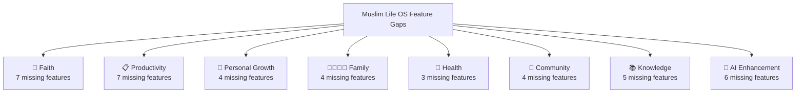
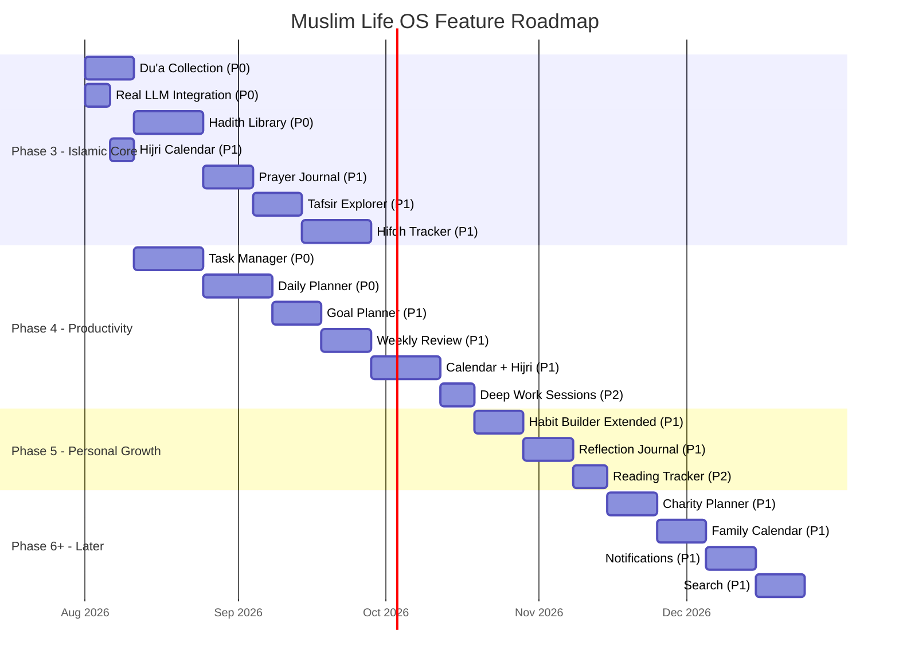

# Muslim Life OS — Phase 3+ Implementation Plan

## Executive Summary

After a thorough audit of the **documentation corpus** (Volumes 00–10) against the **current codebase**, this plan identifies **every essential feature** that the docs mandate but the app does not yet have. Features are grouped into prioritised phases with dependency ordering.

---

## Current State Audit

### ✅ What's Already Built (Phase 1 & 2)

| Domain | Feature | Status |
|--------|---------|--------|
| **Auth** | Register, Login, Password Reset, JWT auth | ✅ Complete |
| **Onboarding** | Multi-step wizard (name, goals, location) | ✅ Complete |
| **Prayer** | Prayer times calculation (9 methods), Asr juristic, prayer logging, prayer status, consistency metrics | ✅ Complete |
| **Qur'an** | Surah list, Ayah reader (Arabic + translation), bookmarks, reading progress, weekly summary | ✅ Complete |
| **Dhikr** | Dhikr items catalogue (morning/evening/general), session logging, daily summary, counter UI | ✅ Complete |
| **AI Assistant** | Conversation CRUD, message threading, AI safety refusal, Postgres-backed storage, memory entries | ✅ Complete |
| **Family** | Family creation, member listing, invite system, member removal, privacy enforcement | ✅ Complete |
| **Fasting** | Daily fasting log, fasting status check | ✅ Complete |
| **Settings** | Location search (Nominatim), prayer method, Asr method, theme switcher (light/dark/system), data export link | ✅ Complete |
| **Navigation** | 5-tab bottom nav (Home, Qur'an, Dhikr, Assistant, Profile) | ✅ Complete |
| **Infrastructure** | PostgreSQL, Alembic migrations, SQLAlchemy repos, Docker Compose | ✅ Complete |

### ❌ What's Missing — Gap Analysis

Comparing the [Feature Catalogue](file:///opt/lifeos/docs/Volume_01_Product_Design/013_Feature_Catalogue.md), [Product Scope](file:///opt/lifeos/docs/Volume_01_Product_Design/012_Product_Scope.md), [Information Architecture](file:///opt/lifeos/docs/Volume_01_Product_Design/017_Information_Architecture.md), and [Product Manifesto](file:///opt/lifeos/docs/Volume_00_Foundation/004_Product_Manifesto.md) against the codebase reveals **8 major feature domains** with significant gaps:

---

## Phase 3 — Core Islamic Features (Highest Priority)

> [!IMPORTANT]
> These are the **most mission-critical** gaps. The app calls itself a "Muslim Life OS" but is missing essential Islamic features that differentiate it from a generic productivity app.

### 3A. Du'a Collection & Manager
**Priority: P0 — Essential** | **Effort: Medium** | **Dependencies: None**

**What**: A curated, searchable library of du'as (supplications) from Qur'an and Sunnah with Arabic text, transliteration, translation, and contextual guidance (when to recite).

**Why**: Mentioned in [Feature Catalogue](file:///opt/lifeos/docs/Volume_01_Product_Design/013_Feature_Catalogue.md#L378) as core Faith feature. Du'as are daily essentials for every Muslim — morning, evening, travel, meals, etc.

**Scope**:
- Backend: `domain/dua/` — Du'a data model, categories (morning, evening, travel, food, sleep, protection, etc.), searchable service
- Backend API: `GET /api/v1/duas`, `GET /api/v1/duas/categories`, `GET /api/v1/duas/{id}`, `POST /api/v1/duas/favourites`
- Frontend: Du'a list with category tabs, du'a detail view (Arabic + transliteration + translation), favourites, search
- Data: Seed ~100 authentic du'as with sources (Qur'an verse or hadith reference)
- Offline: All du'a data cached locally per [031_Offline_First_Experience.md](file:///opt/lifeos/docs/Volume_01_Product_Design/031_Offline_First_Experience.md)

---

### 3B. Hadith Library
**Priority: P0 — Essential** | **Effort: Large** | **Dependencies: None**

**What**: Browsable collection of hadith from major authentic collections (Sahih Bukhari, Sahih Muslim, etc.) with search, bookmarks, and chapter navigation.

**Why**: Listed in [Feature Catalogue](file:///opt/lifeos/docs/Volume_01_Product_Design/013_Feature_Catalogue.md#L376) as core Faith feature. The [Islamic Knowledge Framework](file:///opt/lifeos/docs/Volume_00_Foundation/008_Islamic_Knowledge_Framework.md) mandates authentic Sunnah as Level 2 in the knowledge hierarchy.

**Scope**:
- Backend: `domain/hadith/` — Hadith model (narrator chain, Arabic, translation, grade, book, chapter), search service
- Backend API: `GET /api/v1/hadith/collections`, `GET /api/v1/hadith/search`, `GET /api/v1/hadith/{id}`, `POST /api/v1/hadith/bookmarks`
- Frontend: Collection browser, chapter navigation, hadith card (Arabic + English), search with filters, bookmarks
- Data: Integrate an open hadith dataset (e.g., sunnah.com API or local dataset)
- Must display: source collection, book, chapter, hadith number, grade per [008_Islamic_Knowledge_Framework.md](file:///opt/lifeos/docs/Volume_00_Foundation/008_Islamic_Knowledge_Framework.md#L133-L157)

---

### 3C. Prayer Journal & Insights
**Priority: P1 — High** | **Effort: Medium** | **Dependencies: Prayer logging (✅ exists)**

**What**: Post-prayer reflection journal (how was your khushoo? what distracted you?) and AI-generated insights over time.

**Why**: Listed as "Prayer Journal" and "Prayer Insights" in the [Feature Catalogue](file:///opt/lifeos/docs/Volume_01_Product_Design/013_Feature_Catalogue.md#L371-L372). Aligns with Constitution [Article 6 (Intention Before Action)](file:///opt/lifeos/docs/Volume_00_Foundation/001_Product_Constitution.md#L112-L118) and the emphasis on reflection.

**Scope**:
- Backend: Extend prayer domain with journal entries (prayer_name, date, khushoo_rating 1-5, notes, distractions)
- Backend API: `POST /api/v1/habits/prayers/journal`, `GET /api/v1/habits/prayers/journal`, `GET /api/v1/habits/prayers/insights`
- Frontend: After-prayer reflection prompt (optional), journal history view, weekly/monthly prayer quality chart
- AI Integration: AI can analyze patterns and provide gentle, encouraging insights (per [Article 8](file:///opt/lifeos/docs/Volume_00_Foundation/001_Product_Constitution.md#L140-L166))

---

### 3D. Qur'an Memorisation Assistant (Hifdh Tracker)
**Priority: P1 — High** | **Effort: Large** | **Dependencies: Qur'an module (✅ exists)**

**What**: Structured memorisation (hifdh) tracking with spaced repetition, daily revision targets, and progress tracking per surah/juz.

**Why**: "Memorisation Assistant" in [Feature Catalogue](file:///opt/lifeos/docs/Volume_01_Product_Design/013_Feature_Catalogue.md#L374). This is one of the most requested features for Muslim apps. The [Behavioural Science Framework](file:///opt/lifeos/docs/Volume_00_Foundation/009_Behavioural_Science_Framework.md) supports spaced repetition.

**Scope**:
- Backend: `domain/quran/memorisation.py` — track memorised verses, revision schedule (spaced repetition algorithm), daily targets
- Backend API: `POST /api/v1/quran/memorisation/mark`, `GET /api/v1/quran/memorisation/progress`, `GET /api/v1/quran/memorisation/today-review`
- Frontend: Memorisation dashboard (juz/surah progress grid), daily review queue, "mark as memorised" flow, revision reminders

---

### 3E. Tafsir Explorer
**Priority: P1 — High** | **Effort: Medium** | **Dependencies: Qur'an module (✅ exists)**

**What**: Contextual Qur'an commentary (tafsir) linked to ayahs, allowing users to understand verses deeply.

**Why**: "Tafsir Explorer" in [Feature Catalogue](file:///opt/lifeos/docs/Volume_01_Product_Design/013_Feature_Catalogue.md#L375). The [Islamic Knowledge Framework](file:///opt/lifeos/docs/Volume_00_Foundation/008_Islamic_Knowledge_Framework.md) requires distinguishing source from explanation.

**Scope**:
- Backend: Tafsir data model (linked to surah/ayah), multiple tafsir sources (Ibn Kathir, etc.)
- Backend API: `GET /api/v1/quran/surahs/{id}/ayahs/{id}/tafsir`
- Frontend: Tafsir panel in ayah reader (swipe/tap to reveal), source selector, reading mode
- Data: Integrate an open tafsir dataset

---

### 3F. Islamic Learning Paths
**Priority: P2 — Medium** | **Effort: Large** | **Dependencies: Knowledge domain**

**What**: Structured learning curricula covering essential Islamic topics (Aqidah, Fiqh basics, Seerah, Qur'anic Arabic) with progress tracking.

**Why**: "Islamic Learning Paths" in [Feature Catalogue](file:///opt/lifeos/docs/Volume_01_Product_Design/013_Feature_Catalogue.md#L379). The [Product Manifesto](file:///opt/lifeos/docs/Volume_00_Foundation/004_Product_Manifesto.md#L217-L230) emphasises connected, practical knowledge.

**Scope**:
- Backend: `domain/learning/` — Learning path model (modules, lessons, quizzes), enrollment, progress tracking
- Backend API: CRUD for learning paths, enrollment, lesson completion, quiz results
- Frontend: Learning catalogue, lesson viewer, progress indicators, daily learning goals

---

## Phase 4 — Productivity Domain (High Priority)

> [!NOTE]
> The [Product Scope](file:///opt/lifeos/docs/Volume_01_Product_Design/012_Product_Scope.md#L143-L153) defines Muslim Life OS as a "productivity platform." Currently **zero** productivity features exist beyond prayer/habit tracking.

### 4A. Daily Planner
**Priority: P0 — Essential** | **Effort: Large** | **Dependencies: Prayer times (✅ exists)**

**What**: A day view planner that integrates prayer times as anchor points, allowing users to plan their day around salah. Time-blocking, task assignment to time slots.

**Why**: "Daily Planner" in [Feature Catalogue](file:///opt/lifeos/docs/Volume_01_Product_Design/013_Feature_Catalogue.md#L382). The concept of planning around prayer is uniquely Islamic and central to the app's differentiation.

**Scope**:
- Backend: `domain/planner/` — Day plan model, time blocks, prayer-anchored scheduling
- Backend API: CRUD for daily plans, time blocks
- Frontend: Timeline view with prayer times as fixed anchors, drag-and-drop time blocks, day summary
- AI Integration: AI can suggest optimal time blocks based on user patterns

---

### 4B. Task Manager
**Priority: P0 — Essential** | **Effort: Large** | **Dependencies: None**

**What**: Simple but powerful task management with projects, priorities, due dates, recurring tasks, and Islamic priority alignment (worship → family → community → work).

**Why**: "Task Manager" in [Feature Catalogue](file:///opt/lifeos/docs/Volume_01_Product_Design/013_Feature_Catalogue.md#L385). Core productivity feature. Without it, the app cannot function as a "life operating system."

**Scope**:
- Backend: `domain/task/` — Task model (title, description, priority, due_date, project, recurrence, completed, niyyah/intention field)
- Backend API: Full CRUD, filters (today, upcoming, overdue, by project), bulk operations
- Frontend: Task list with filters, quick-add, project views, inbox, today view
- Unique: Optional "intention" field on tasks — why are you doing this? (per [Article 6](file:///opt/lifeos/docs/Volume_00_Foundation/001_Product_Constitution.md#L112-L118))

---

### 4C. Goal Planner
**Priority: P1 — High** | **Effort: Medium** | **Dependencies: Task Manager**

**What**: Long-term goal setting with milestones, linked tasks, and progress tracking. Support for spiritual goals, family goals, career goals, health goals.

**Why**: "Goal Planner" in [Feature Catalogue](file:///opt/lifeos/docs/Volume_01_Product_Design/013_Feature_Catalogue.md#L389). The [Product Manifesto](file:///opt/lifeos/docs/Volume_00_Foundation/004_Product_Manifesto.md#L96-L112) defines productivity as "doing what matters most."

**Scope**:
- Backend: `domain/goal/` — Goal model (title, category, target_date, milestones, linked_tasks, progress)
- Backend API: CRUD for goals, milestones, progress updates
- Frontend: Goal overview with progress bars, milestone timeline, linked task list

---

### 4D. Calendar Integration
**Priority: P1 — High** | **Effort: Medium** | **Dependencies: Daily Planner, Prayer times**

**What**: Personal calendar with Islamic date (Hijri) display alongside Gregorian, prayer times overlay, and optional iCal sync.

**Why**: "Calendar" in [Feature Catalogue](file:///opt/lifeos/docs/Volume_01_Product_Design/013_Feature_Catalogue.md#L384). The [Product Scope](file:///opt/lifeos/docs/Volume_01_Product_Design/012_Product_Scope.md#L148) lists Calendar as a core productivity feature.

**Scope**:
- Backend: Event model, Hijri date conversion, recurring events
- Backend API: CRUD events, calendar view endpoints (day/week/month)
- Frontend: Month/week/day views, Hijri date labels, prayer times overlay, event creation

---

### 4E. Weekly Review
**Priority: P1 — High** | **Effort: Medium** | **Dependencies: Prayer logging, Task Manager, Habit Builder**

**What**: Guided weekly review workflow to reflect on worship quality, task completion, habit consistency, and set intentions for the coming week.

**Why**: "Weekly Review" and "Monthly Review" in [Feature Catalogue](file:///opt/lifeos/docs/Volume_01_Product_Design/013_Feature_Catalogue.md#L387-L388). Aligns deeply with the reflection philosophy.

**Scope**:
- Backend: Review entry model, auto-generated weekly stats
- Backend API: `POST /api/v1/reviews/weekly`, `GET /api/v1/reviews/weekly/current`
- Frontend: Step-by-step review wizard (prayer recap → habits recap → tasks recap → gratitude → intentions)

---

### 4F. Deep Work Sessions
**Priority: P2 — Medium** | **Effort: Small** | **Dependencies: None**

**What**: Focus timer with Pomodoro-style sessions, distraction-free mode, and session logging.

**Why**: "Deep Work Sessions" in [Feature Catalogue](file:///opt/lifeos/docs/Volume_01_Product_Design/013_Feature_Catalogue.md#L386). The [Product Constitution Article 10](file:///opt/lifeos/docs/Volume_00_Foundation/001_Product_Constitution.md#L186-L195) mandates respect for time.

**Scope**:
- Backend: Session log model (duration, task, focus_quality)
- Backend API: `POST /api/v1/productivity/focus-sessions`
- Frontend: Timer UI, session settings, daily focus time stats

---

### 4G. Time Blocking
**Priority: P2 — Medium** | **Effort: Medium** | **Dependencies: Daily Planner, Calendar**

**What**: Visual time-blocking interface integrated with the daily planner.

**Why**: Listed under [Productivity domain](file:///opt/lifeos/docs/Volume_01_Product_Design/012_Product_Scope.md#L151).

---

## Phase 5 — Personal Growth Domain

### 5A. Habit Builder (Extended)
**Priority: P1 — High** | **Effort: Medium** | **Dependencies: Fasting tracker (✅ exists)**

**What**: General-purpose habit tracker beyond prayer and fasting. Create custom habits (reading Qur'an daily, exercise, morning adhkar, etc.) with streaks, frequency options, and visual progress.

**Why**: "Habit Builder" in [Feature Catalogue](file:///opt/lifeos/docs/Volume_01_Product_Design/013_Feature_Catalogue.md#L393). Currently only prayer and fasting are trackable. The [Behavioural Science Framework](file:///opt/lifeos/docs/Volume_00_Foundation/009_Behavioural_Science_Framework.md) outlines identity-based habit formation.

**Scope**:
- Backend: `domain/habit/` — Generic habit model (name, frequency, icon, category, streak, completions)
- Backend API: CRUD habits, log completions, get streaks, consistency metrics
- Frontend: Habit dashboard with daily checklist, streak counter, weekly/monthly heat map
- Constitutional constraint: Per [Article 5](file:///opt/lifeos/docs/Volume_00_Foundation/001_Product_Constitution.md#L94-L109), worship habits show encouragement, never leaderboards

---

### 5B. Reflection Journal
**Priority: P1 — High** | **Effort: Medium** | **Dependencies: None**

**What**: Private journaling with Islamic reflection prompts. Daily or weekly reflections on gratitude, self-improvement, and spiritual growth.

**Why**: "Reflection Journal" in [Feature Catalogue](file:///opt/lifeos/docs/Volume_01_Product_Design/013_Feature_Catalogue.md#L394). Reflection is a core theme across the [Product Constitution](file:///opt/lifeos/docs/Volume_00_Foundation/001_Product_Constitution.md), [Manifesto](file:///opt/lifeos/docs/Volume_00_Foundation/004_Product_Manifesto.md), and [Philosophy](file:///opt/lifeos/docs/Volume_01_Product_Design/010_Product_Philosophy.md).

**Scope**:
- Backend: `domain/journal/` — Journal entry model (date, type, mood, content, prompts_used, private)
- Backend API: CRUD journal entries, prompt library
- Frontend: Journal editor with optional AI-generated Islamic prompts, entry history, mood tracking
- Privacy: Journal entries are **absolutely private** — never shared with family per [Article 9](file:///opt/lifeos/docs/Volume_00_Foundation/001_Product_Constitution.md#L169-L183)

---

### 5C. Reading Tracker
**Priority: P2 — Medium** | **Effort: Small** | **Dependencies: None**

**What**: Track books being read (Islamic and general), reading goals, notes, and book library.

**Why**: "Reading Tracker" in [Feature Catalogue](file:///opt/lifeos/docs/Volume_01_Product_Design/013_Feature_Catalogue.md#L395).

**Scope**:
- Backend: Book model (title, author, category, pages, current_page, status, notes)
- Backend API: CRUD books, reading log, reading goals
- Frontend: Book shelf view, reading progress, notes per book

---

### 5D. Skill Roadmaps
**Priority: P3 — Low** | **Effort: Large** | **Dependencies: Learning Paths**

**What**: Personalised skill development roadmaps with milestone tracking.

**Why**: "Skill Roadmaps" in [Feature Catalogue](file:///opt/lifeos/docs/Volume_01_Product_Design/013_Feature_Catalogue.md#L396).

---

## Phase 6 — Family Experience (Deepening)

> [!IMPORTANT]
> Per [Article 13](file:///opt/lifeos/docs/Volume_00_Foundation/001_Product_Constitution.md#L223-L235), family features should strengthen family life. The [Family Experience doc](file:///opt/lifeos/docs/Volume_01_Product_Design/026_Family_Experience.md) and [Children Experience doc](file:///opt/lifeos/docs/Volume_01_Product_Design/027_Children_Experience.md) define extensive requirements.

### 6A. Shared Family Calendar
**Priority: P1 — High** | **Effort: Medium** | **Dependencies: Calendar (Phase 4D), Family module (✅ exists)**

**What**: Shared calendar for family events, meal planning, school schedules, with privacy-preserving design.

**Why**: "Shared Calendar" in [Feature Catalogue](file:///opt/lifeos/docs/Volume_01_Product_Design/013_Feature_Catalogue.md#L400).

---

### 6B. Family Goals
**Priority: P2 — Medium** | **Effort: Medium** | **Dependencies: Goal Planner, Family module**

**What**: Shared goals the family works toward together (e.g., charity target, Qur'an reading, family outing planning).

**Why**: "Family Goals" in [Feature Catalogue](file:///opt/lifeos/docs/Volume_01_Product_Design/013_Feature_Catalogue.md#L401).

---

### 6C. Parent Dashboard
**Priority: P2 — Medium** | **Effort: Large** | **Dependencies: Family module, Habit Builder**

**What**: Dashboard for parents to gently guide children's learning and habit development. Age-appropriate views for dependents.

**Why**: "Parent Dashboard" in [Feature Catalogue](file:///opt/lifeos/docs/Volume_01_Product_Design/013_Feature_Catalogue.md#L402). The [Children Experience](file:///opt/lifeos/docs/Volume_01_Product_Design/027_Children_Experience.md) doc mandates designed-for-children UX.

---

### 6D. Household Tasks
**Priority: P2 — Medium** | **Effort: Small** | **Dependencies: Task Manager, Family module**

**What**: Shared household task management with assignment and rotation.

**Why**: "Household Tasks" in [Feature Catalogue](file:///opt/lifeos/docs/Volume_01_Product_Design/013_Feature_Catalogue.md#L403).

---

## Phase 7 — Health Domain

### 7A. Sleep Tracker / Planner
**Priority: P2 — Medium** | **Effort: Medium** | **Dependencies: None**

**What**: Track sleep/wake times, calculate sleep quality, integrate with prayer times (Fajr alarm). Suggest optimal sleep/wake times based on Fajr.

**Why**: "Sleep Planner" in [Feature Catalogue](file:///opt/lifeos/docs/Volume_01_Product_Design/013_Feature_Catalogue.md#L414). The body is an amanah per the [Manifesto](file:///opt/lifeos/docs/Volume_00_Foundation/004_Product_Manifesto.md#L276-L296).

---

### 7B. Exercise Tracker
**Priority: P2 — Medium** | **Effort: Small** | **Dependencies: Habit Builder**

**What**: Simple exercise logging with types, duration, and weekly goals.

**Why**: "Exercise Planner" in [Feature Catalogue](file:///opt/lifeos/docs/Volume_01_Product_Design/013_Feature_Catalogue.md#L415).

---

### 7C. Energy Tracking & Wellbeing
**Priority: P3 — Low** | **Effort: Small** | **Dependencies: None**

**What**: Daily energy/mood self-assessment for long-term wellbeing patterns.

**Why**: "Energy Tracking" and "Wellbeing" in [Feature Catalogue](file:///opt/lifeos/docs/Volume_01_Product_Design/013_Feature_Catalogue.md#L416).

---

## Phase 8 — Community Domain

### 8A. Charity Planner (Sadaqah / Zakat)
**Priority: P1 — High** | **Effort: Medium** | **Dependencies: None**

**What**: Track charitable giving (sadaqah, zakat, fidyah), zakat calculator, giving goals, and donation history.

**Why**: "Charity Planner" in [Feature Catalogue](file:///opt/lifeos/docs/Volume_01_Product_Design/013_Feature_Catalogue.md#L409). Financial ethics is [Article 16](file:///opt/lifeos/docs/Volume_00_Foundation/001_Product_Constitution.md#L270-L286). Charity is fundamental to Islam.

**Scope**:
- Backend: Donation model (type, amount, date, recipient, category), zakat calculation service
- Backend API: CRUD donations, zakat calculator, giving summary
- Frontend: Giving dashboard, zakat calculator, monthly/yearly giving summary, goals

---

### 8B. Masjid Directory
**Priority: P2 — Medium** | **Effort: Medium** | **Dependencies: Location services (✅ exists)**

**What**: Find nearby mosques with prayer times, directions, and community info.

**Why**: "Masjid Directory" in [Feature Catalogue](file:///opt/lifeos/docs/Volume_01_Product_Design/013_Feature_Catalogue.md#L407). [Article 14](file:///opt/lifeos/docs/Volume_00_Foundation/001_Product_Constitution.md#L238-L252) mandates encouraging masjid involvement.

---

### 8C. Volunteer Opportunities
**Priority: P3 — Low** | **Effort: Medium** | **Dependencies: Community domain**

**Why**: Listed in [Feature Catalogue](file:///opt/lifeos/docs/Volume_01_Product_Design/013_Feature_Catalogue.md#L408).

---

### 8D. Local Events
**Priority: P3 — Low** | **Effort: Medium** | **Dependencies: Calendar, Community domain**

**Why**: "Local Events" in [Feature Catalogue](file:///opt/lifeos/docs/Volume_01_Product_Design/013_Feature_Catalogue.md#L410).

---

## Phase 9 — Knowledge Domain

### 9A. Notes System
**Priority: P1 — High** | **Effort: Large** | **Dependencies: None**

**What**: Rich-text note-taking linked to Qur'an verses, hadith, books, and learning paths. Knowledge building tool.

**Why**: "Notes" in [Feature Catalogue](file:///opt/lifeos/docs/Volume_01_Product_Design/013_Feature_Catalogue.md#L223). The [Knowledge Graph Architecture](file:///opt/lifeos/docs/Volume_02_AI_Architecture/043_Knowledge_Graph_Architecture.md) envisions interconnected knowledge.

---

### 9B. Book Library
**Priority: P2 — Medium** | **Effort: Medium** | **Dependencies: Reading Tracker**

**Why**: "Book Library" in [Feature Catalogue](file:///opt/lifeos/docs/Volume_01_Product_Design/013_Feature_Catalogue.md#L223).

---

### 9C. Flashcards
**Priority: P2 — Medium** | **Effort: Medium** | **Dependencies: None**

**What**: Spaced-repetition flashcard system for memorising Islamic knowledge, Arabic vocabulary, Qur'an verses.

**Why**: "Flashcards" in [Feature Catalogue](file:///opt/lifeos/docs/Volume_01_Product_Design/013_Feature_Catalogue.md#L226).

---

### 9D. Courses
**Priority: P3 — Low** | **Effort: Large** | **Dependencies: Learning Paths**

**Why**: "Courses" in [Feature Catalogue](file:///opt/lifeos/docs/Volume_01_Product_Design/013_Feature_Catalogue.md#L225).

---

### 9E. Knowledge Graph
**Priority: P3 — Low** | **Effort: Very Large** | **Dependencies: Notes, multiple content domains**

**Why**: "Knowledge Graph" in [Feature Catalogue](file:///opt/lifeos/docs/Volume_01_Product_Design/013_Feature_Catalogue.md#L224). Detailed in [043_Knowledge_Graph_Architecture.md](file:///opt/lifeos/docs/Volume_02_AI_Architecture/043_Knowledge_Graph_Architecture.md).

---

## Phase 10 — AI Enhancement

### 10A. Daily AI Coach
**Priority: P1 — High** | **Effort: Medium** | **Dependencies: AI Assistant (✅ exists), all tracking data**

**What**: Proactive daily coaching that synthesizes prayer consistency, habit data, goals, and journal entries to provide personalised, gentle Islamic guidance.

**Why**: "Daily Coach" in [Feature Catalogue](file:///opt/lifeos/docs/Volume_01_Product_Design/013_Feature_Catalogue.md#L420). Must respect [Article 8 (AI Boundaries)](file:///opt/lifeos/docs/Volume_00_Foundation/001_Product_Constitution.md#L140-L166).

---

### 10B. AI Planning Assistant
**Priority: P1 — High** | **Effort: Medium** | **Dependencies: Daily Planner, Task Manager**

**What**: AI that helps plan your day/week, suggests priorities based on Islamic values, and helps with time management.

**Why**: "Planning Assistant" in [Feature Catalogue](file:///opt/lifeos/docs/Volume_01_Product_Design/013_Feature_Catalogue.md#L421).

---

### 10C. AI Reflection Assistant
**Priority: P2 — Medium** | **Effort: Medium** | **Dependencies: Journal, Prayer Journal**

**What**: AI that generates thoughtful Islamic reflection prompts and helps users process their journal entries.

**Why**: "Reflection Assistant" in [Feature Catalogue](file:///opt/lifeos/docs/Volume_01_Product_Design/013_Feature_Catalogue.md#L422).

---

### 10D. AI Learning Coach
**Priority: P2 — Medium** | **Effort: Medium** | **Dependencies: Learning Paths, Qur'an**

**What**: AI that adapts learning content, quizzes, and recommendations based on user's knowledge level.

**Why**: "Learning Coach" in [Feature Catalogue](file:///opt/lifeos/docs/Volume_01_Product_Design/013_Feature_Catalogue.md#L424).

---

### 10E. Real LLM Provider Integration
**Priority: P0 — Essential** | **Effort: Small** | **Dependencies: AI module (✅ exists)**

**What**: Connect the AI backend to a real LLM (OpenAI, Anthropic, or open-source). Currently using in-memory stub.

**Why**: The AI assistant is useless without a real provider. All AI features depend on this.

**Scope**:
- Configure `MLOS_AI_PROVIDER=openai` with API key
- Implement Islamic safety system prompt per [AI Safety Framework](file:///opt/lifeos/docs/Volume_02_AI_Architecture/048_AI_Safety_Framework.md)
- Add confidence indicators to responses per [Islamic Knowledge Framework](file:///opt/lifeos/docs/Volume_00_Foundation/008_Islamic_Knowledge_Framework.md#L215-L236)

---

### 10F. AI Memory & Personalisation
**Priority: P1 — High** | **Effort: Medium** | **Dependencies: Real LLM, Memory module (✅ exists)**

**What**: AI that remembers user context, preferences, goals, and previous conversations to provide personalised coaching.

**Why**: [AI Memory Architecture](file:///opt/lifeos/docs/Volume_02_AI_Architecture/041_AI_Memory_Architecture.md) and [Personalisation Framework](file:///opt/lifeos/docs/Volume_01_Product_Design/029_Personalisation_Framework.md).

---

## Cross-Cutting Features (Needed Across All Phases)

### CC1. Notification System
**Priority: P1 — High** | **Effort: Medium**

**What**: Push notifications for prayer times, habit reminders, review prompts, family events. Per the [Notification Framework](file:///opt/lifeos/docs/Volume_01_Product_Design/023_Notification_Framework.md), notifications must be respectful, optional, and never used for engagement manipulation.

---

### CC2. Search
**Priority: P1 — High** | **Effort: Medium**

**What**: Global search across all content — Qur'an, hadith, du'as, tasks, notes, goals.

---

### CC3. Hijri Calendar Support
**Priority: P1 — High** | **Effort: Small**

**What**: Islamic (Hijri) date display throughout the app, especially on the home page and calendar.

---

### CC4. Internationalisation (i18n)
**Priority: P2 — Medium** | **Effort: Large**

**What**: Multi-language support starting with Arabic, Urdu, Turkish, Malay, French. Per [035_Internationalisation_and_Localisation.md](file:///opt/lifeos/docs/Volume_01_Product_Design/035_Internationalisation_and_Localisation.md).

---

### CC5. Offline-First Architecture
**Priority: P2 — Medium** | **Effort: Large**

**What**: Core features (prayer times, du'as, Qur'an, dhikr, tasks) must work offline. Per [031_Offline_First_Experience.md](file:///opt/lifeos/docs/Volume_01_Product_Design/031_Offline_First_Experience.md).

---

### CC6. Data Export & Portability
**Priority: P2 — Medium** | **Effort: Small**

**What**: Full data export (JSON/CSV) for user ownership. Per [Article 9](file:///opt/lifeos/docs/Volume_00_Foundation/001_Product_Constitution.md#L169-L183) and [030_Settings_and_Privacy_UX.md](file:///opt/lifeos/docs/Volume_01_Product_Design/030_Settings_and_Privacy_UX.md).

---

## Recommended Implementation Order

---

## Priority Summary Table

| Priority | Feature | Domain | Effort |
|----------|---------|--------|--------|
| **P0** | Du'a Collection | Faith | Medium |
| **P0** | Hadith Library | Faith | Large |
| **P0** | Real LLM Integration | AI | Small |
| **P0** | Task Manager | Productivity | Large |
| **P0** | Daily Planner | Productivity | Large |
| **P1** | Prayer Journal & Insights | Faith | Medium |
| **P1** | Hifdh / Memorisation Tracker | Faith | Large |
| **P1** | Tafsir Explorer | Faith | Medium |
| **P1** | Goal Planner | Productivity | Medium |
| **P1** | Calendar + Hijri | Productivity | Medium |
| **P1** | Weekly Review | Productivity | Medium |
| **P1** | Habit Builder (Extended) | Personal Growth | Medium |
| **P1** | Reflection Journal | Personal Growth | Medium |
| **P1** | Charity / Zakat Planner | Community | Medium |
| **P1** | AI Daily Coach | AI | Medium |
| **P1** | AI Planning Assistant | AI | Medium |
| **P1** | AI Memory & Personalisation | AI | Medium |
| **P1** | Notifications System | Cross-cutting | Medium |
| **P1** | Global Search | Cross-cutting | Medium |
| **P1** | Hijri Calendar | Cross-cutting | Small |
| **P1** | Shared Family Calendar | Family | Medium |
| **P2** | Islamic Learning Paths | Faith | Large |
| **P2** | Deep Work Sessions | Productivity | Small |
| **P2** | Time Blocking | Productivity | Medium |
| **P2** | Reading Tracker | Personal Growth | Small |
| **P2** | Masjid Directory | Community | Medium |
| **P2** | Notes System | Knowledge | Large |
| **P2** | Book Library | Knowledge | Medium |
| **P2** | Flashcards | Knowledge | Medium |
| **P2** | AI Reflection Assistant | AI | Medium |
| **P2** | AI Learning Coach | AI | Medium |
| **P2** | Sleep Tracker | Health | Medium |
| **P2** | Exercise Tracker | Health | Small |
| **P2** | Family Goals | Family | Medium |
| **P2** | Parent Dashboard | Family | Large |
| **P2** | Household Tasks | Family | Small |
| **P2** | i18n | Cross-cutting | Large |
| **P2** | Offline-First | Cross-cutting | Large |
| **P2** | Data Export | Cross-cutting | Small |
| **P3** | Energy/Wellbeing | Health | Small |
| **P3** | Volunteer Opportunities | Community | Medium |
| **P3** | Local Events | Community | Medium |
| **P3** | Courses | Knowledge | Large |
| **P3** | Knowledge Graph | Knowledge | Very Large |
| **P3** | Skill Roadmaps | Personal Growth | Large |

---

## Design Rules (Non-Negotiable)

All implementations must follow these rules from the [design corpus](file:///opt/lifeos/docs/Volume_01_Product_Design):

- ✅ 8-pt grid spacing tokens
- ✅ 48×48 dp minimum touch targets
- ✅ Token-based theming (light/dark/system, no reload)
- ✅ WCAG 2.2 AA accessibility
- ✅ `rem`/`em` typography, resizable to 200%
- ✅ `prefers-reduced-motion` support
- ✅ Undo toast (10s) for reversible actions; confirm dialog only for irreversible ops
- ✅ Live form validation
- ✅ Max 3 navigation depth levels
- ✅ **Never gamify worship** — no leaderboards, no competitive rankings
- ✅ **Privacy-first** — worship/journal data never shared with family members
- ✅ **AI boundaries** — AI is a coach, not a scholar or imam
